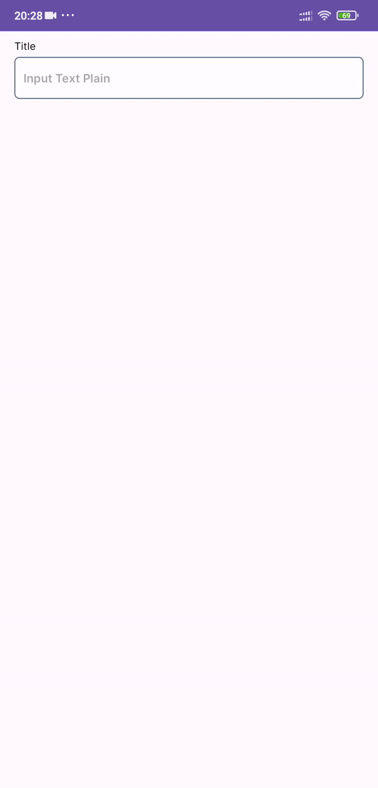
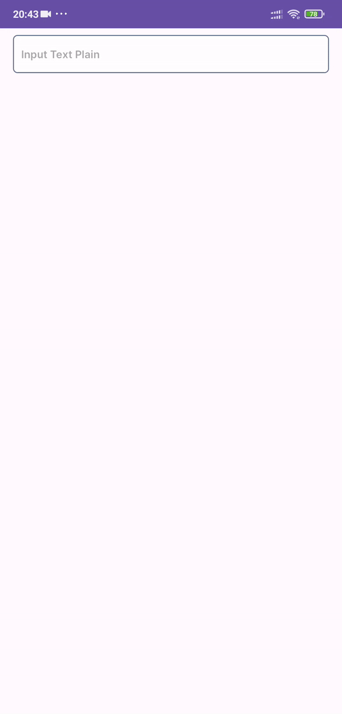
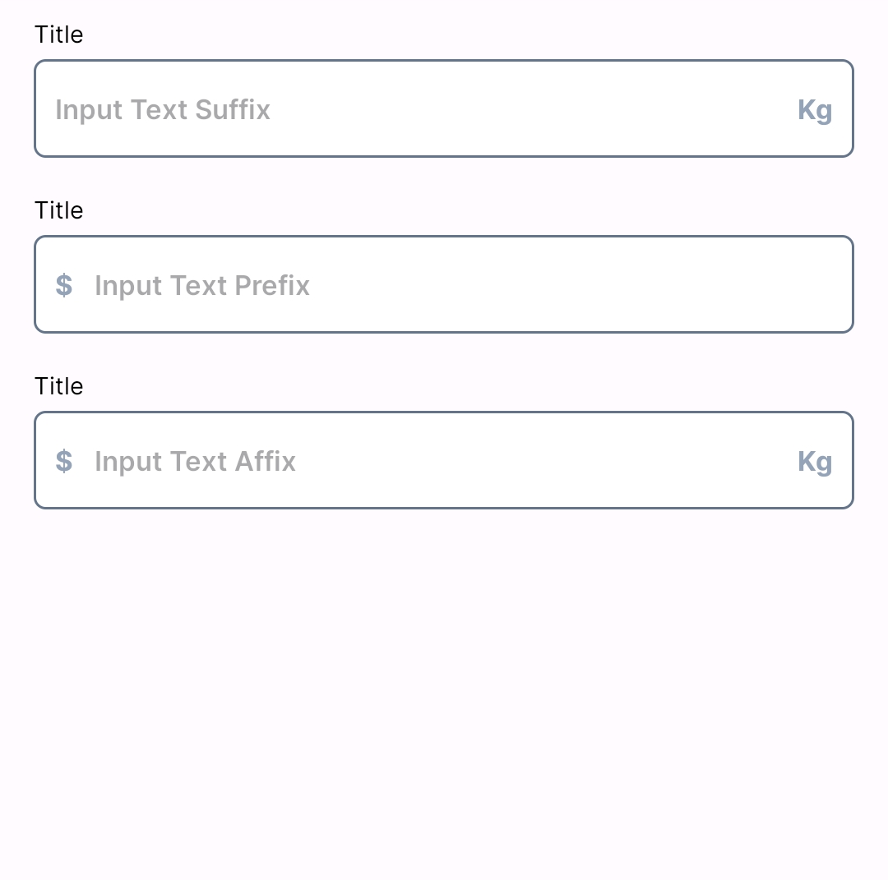
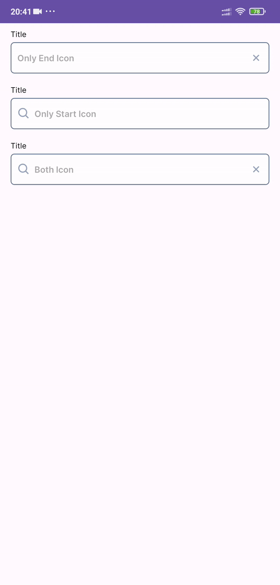
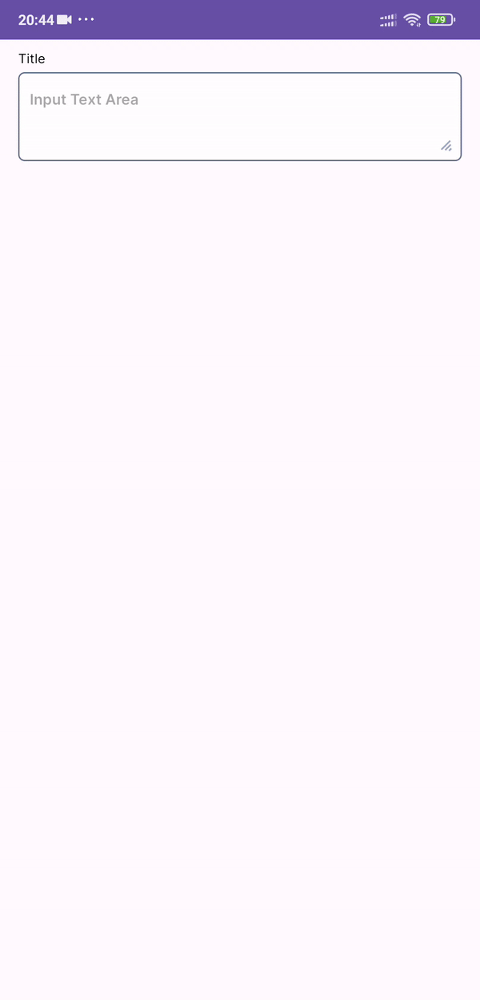
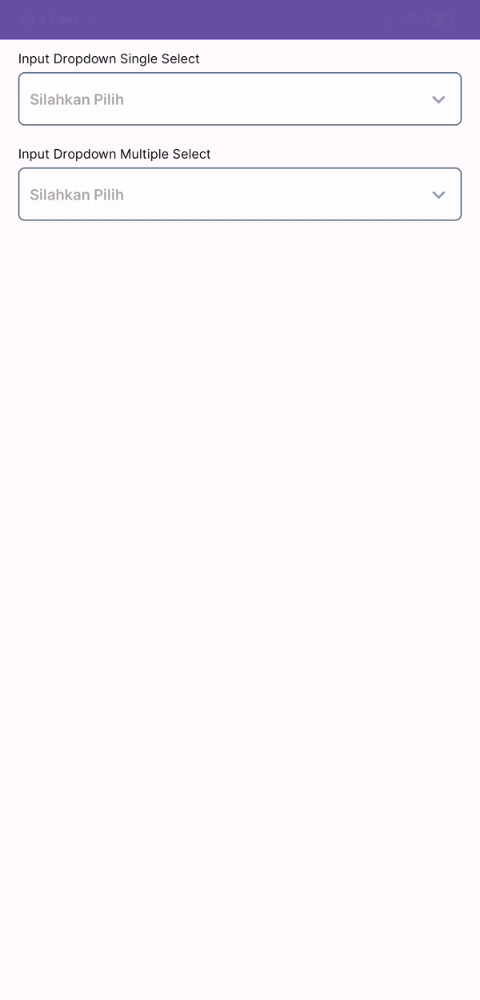

# EpzigDesignSystem

Required compileSdk 33
# Getting started
Step 1. Add the JitPack repository to your build file. Add it in your root setting.gradle at the end of repositories:
```gradle
dependencyResolutionManagement {
    repositoriesMode.set(RepositoriesMode.FAIL_ON_PROJECT_REPOS)
    repositories {
        mavenCentral()
        maven { url 'https://jitpack.io' }
    }
}
```
Step 2. Add the dependency
```gradle
dependencies {
    implementation 'com.github.dimas-prasetyo:EpzigDesignSystem:1.0.8'
}
```

# Contents
# Input
**Contents**

*   [Input Text Plain](#input-text-plain)
*   [Input Text Password](#input-text-password)
*   [Input Text Affix](#input-text-affix)
*   [Input Text Icon](#input-text-icon)
*   [Input Text Area](#input-text-area)
*   [Input Text Dropdown](#input-text-dropdown)

## Input Text Plain
      


In the layout:
```xml
<com.dimasbintang.design_system.inputText.InputTextPlain
    android:layout_width="match_parent"
    android:layout_height="wrap_content"
    app:title="Title"
    app:hint="Input Text Plain"
/>
```
#### Input Text Plain attributes

Element          | Attribute                   | Default value            | Data type            | Summary
---------------- | --------------------------- | -----------------------  | -------------------  | -----------------------------------------
**Title**        | `app:title`                 | `null`                   | String               | Give title top of input text
**Text**         | `android:text`              | `null`                   | String               | Set text of intput text
**Hint**         | `app:hint`                  | `null`                   | String               | Set hint of input text


## Input Text Password
 

In the layout:
```xml
<com.dimasbintang.design_system.inputText.InputPassword
    android:layout_width="match_parent"
    android:layout_height="wrap_content"
    app:title="Title"
    app:hint="Input Text Plain"
/>
```
#### Input Text Password attributes

Element          | Attribute                   | Default value            | Data type            | Summary
---------------- | --------------------------- | -----------------------  | -------------------  | -----------------------------------------
**Title**        | `app:title`                 | `null`                   | String               | Give title top of input text
**Text**         | `android:text`              | `null`                   | String               | Set text of intput text
**Hint**         | `app:hint`                  | `null`                   | String               | Set hint of input text

## Input Text Affix
 


In the layout:
```xml
<com.dimasbintang.design_system.inputText.InputTextAffix
    android:layout_width="match_parent"
    android:layout_height="wrap_content"
    app:title="Title"
    app:hint="Input Text Suffix"
    app:suffixText="Kg"
/>
```
#### Input Text Affix attributes

Element              | Attribute                   | Default value            | Default value            | Summary
----------------     | --------------------------- | -----------------------  | -----------------------  | -----------------------------------------
**Title**            | `app:title`                 | `null`                   | String                   | Give title top of input text
**Text**             | `android:text`              | `null`                   | String                   | Set text of intput text
**Hint**             | `app:hint`                  | `null`                   | String                   | Set hint of input text
**Suffix**           | `app:suffixText`                  | `null`             | String                   | Set suffix of input text
**Prefix**           | `app:prefixText`                  | `null`             | String                   | Set perifx of input text
**Affix Tint**       | `app:affixTint`                  | `null`              | Color                   | Set color for prefix and suffix


## Input Text Icon
 

In the layout:
```xml
<com.dimasbintang.design_system.inputText.InputTextIcon
    android:id="@+id/inputIcon"
    android:layout_width="match_parent"
    android:layout_height="wrap_content"
    app:title="Title"
    app:hint="Input Text Icon"
    android:drawableStart="@drawable/bx_search"
    android:drawableEnd="@drawable/bx_x"
/>
```
#### Input Text Affix attributes

Element              | Attribute                   | Default value            | Default value            | Summary
----------------     | --------------------------- | -----------------------  | -----------------------  | -----------------------------------------
**Title**            | `app:title`                 | `null`                   | String                   | Give title top of input text
**Text**             | `android:text`              | `null`                   | String                   | Set text of intput text
**Hint**             | `app:hint`                  | `null`                   | String                   | Set hint of input text
**Start Icon**           | `android:drawableStart`                  | `null`             | Drawable                   | Set suffix of input text
**End Icon**           | `android:drawableEnd`                  | `null`             | Drawable                   | Set perifx of input text
**Affix Tint**       | `android:drawableTint`                  | `null`              | Color                   | Set color for prefix and suffix

#### Related methods:

#### For disable click on icon:
```kt
binding.inputIcon.startIconIsClickable(false)
binding.inputIcon.endIconIsClickable(false)
```

## Input Text Area
 

In the layout:
```xml
<com.dimasbintang.design_system.inputText.InputTextArea
    android:layout_width="match_parent"
    android:layout_height="wrap_content"
    app:title="Title"
    app:hint="Input Text Plain"
    app:maxLines="5"
/>
```
#### Input Text Area attributes

Element              | Attribute                   | Default value            | Default value            | Summary
----------------     | --------------------------- | -----------------------  | -----------------------  | -----------------------------------------
**Title**            | `app:title`                 | `null`                   | String                   | Give title top of input text
**Text**             | `android:text`              | `null`                   | String                   | Set text of intput text
**Hint**             | `app:hint`                  | `null`                   | String                   | Set hint of input text
**Max Lines**           | `app:maxLines`                  | `null`             | Int                   | Set suffix of input text


## Input Text Dropdown
 

In the layout:
```xml
<com.dimasbintang.design_system.dropdown.InputDropdown
    android:id="@+id/inputDropdown"
    android:layout_width="match_parent"
    android:layout_height="wrap_content"
    app:title="Title"
    app:hint="Input Text Dropdown"
    app:isMultipleSelect="false"
/>
```
#### Input Text Area attributes

Element              | Attribute                   | Default value            | Default value            | Summary
----------------     | --------------------------- | -----------------------  | -----------------------  | -----------------------------------------
**Title**            | `app:title`                 | `null`                   | String                   | Give title top of input text
**Text**             | `android:text`              | `null`                   | String                   | Set text of intput text
**Hint**             | `app:hint`                  | `null`                   | String                   | Set hint of input text
**Multiple select**           | `app:isMultipleSelect`                  | `null`             | Boolean                   | Set suffix of input text

#### Related methods:

#### Create list dropdown

Support Object:
```kt
data class ItemDropdown(
    val text: String,
    val startIcon: Drawable? = null,
    val endIcon: Drawable? = null,
    var isSelected: Boolean = false
)
```
create list:

```kt
import com.dimasbintang.design_system.helper.DropdownMapper.addItemDropdown
import com.dimasbintang.design_system.model.ItemDropdown

val items = arrayListOf<ItemDropdown>()
items.addItemDropdown("Alarm") // item only contains text
items.addItemDropdown("Alarm", ContextCompat.getDrawable(this, com.dimasbintang.design_system.R.drawable.bx_alarm)) // item with start icon
items.addItemDropdown("Alarm", null, ContextCompat.getDrawable(this, com.dimasbintang.design_system.R.drawable.bx_alarm)) // item with end icon
items.addItemDropdown("Alarm", ContextCompat.getDrawable(this, com.dimasbintang.design_system.R.drawable.bx_alarm), ContextCompat.getDrawable(this, com.dimasbintang.design_system.R.drawable.bx_plus)) // item with both start and end icon
```

add list to dropdown:
```kt
binding.inputDropdown.setItemDropdown(items)

// set listener when click item
binding.inputDropdown.onSelectedItem = {
    // action
}
```


