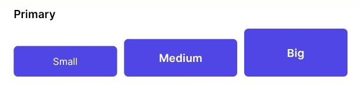
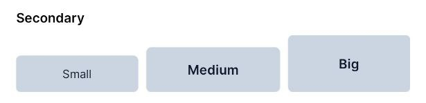
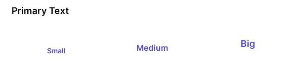
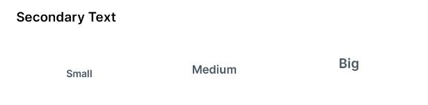
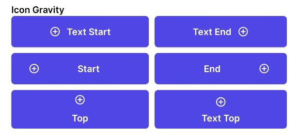
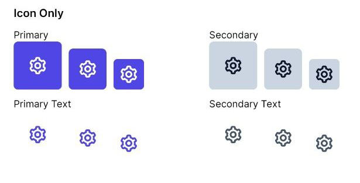

# Buttons

 

*   [Size](#size)
*   [Style](#style)
*   [Icon Gravity](#icon_gravity)
*   [Icon Only](#icon_only)

## Size
| Size      | Minimal Height      | Text Appearance |
| --------- | ------------------- | --------------- |
| Small     | 36dp                | `@style/subtitle`|
| Medium    | 44dp                | `@style/body`  |
| Big       | 56dp                | `@style/body`  |


## Style

### Primary ###


In the layout:
```xml
<Button
  ...
  style="@style/PrimaryButton.Small"
/>
<Button
  ...
  style="@style/PrimaryButton.Medium"
/>
<Button
  ...
  style="@style/PrimaryButton.Big"
/>
```


### Secondary ###


In the layout:
```xml
<Button
  ...
  style="@style/SecondaryButton.Small"
/>
<Button
  ...
  style="@style/SecondaryButton.Medium"
/>
<Button
  ...
  style="@style/SecondaryButton.Big"
/>
```


### Primary Text ###


In the layout:
```xml
<Button
  ...
  style="@style/TextPrimaryButton.Small"
/>
<Button
  ...
  style="@style/TextPrimaryButton.Medium"
/>
<Button
  ...
  style="@style/TextPrimaryButton.Big"
/>
```


### Secondary Text ###


In the layout:
```xml
<Button
  ...
  style="@style/TextSecondaryButton.Small"
/>
<Button
  ...
  style="@style/TextSecondaryButton.Medium"
/>
<Button
  ...
  style="@style/TextSecondaryButton.Big"
/>
```

## Icon Gravity



In the layout:
```xml
<Button
  ...
  style="@style/TextSecondaryButton.Medium"
  app:icon="@drawable/bx_plus_circle"
  app:iconGravity="textStart"
/>
<Button
  ...
  style="@style/TextSecondaryButton.Medium"
  app:icon="@drawable/bx_plus_circle"
  app:iconGravity="textEnd"
/>
<Button
  ...
  style="@style/TextSecondaryButton.Medium"
  app:icon="@drawable/bx_plus_circle"
  app:iconGravity="start"
/>
<Button
  ...
  style="@style/TextSecondaryButton.Medium"
  app:icon="@drawable/bx_plus_circle"
  app:iconGravity="end"
/>
<Button
  ...
  style="@style/TextSecondaryButton.Medium"
  app:icon="@drawable/bx_plus_circle"
  app:iconGravity="top"
/>
<Button
  ...
  style="@style/TextSecondaryButton.Medium"
  app:icon="@drawable/bx_plus_circle"
  app:iconGravity="textTop"
/>
```


## Icon Only



| Style name                    | Big                                                | Medium                                                | Small                                                  |
| ----------------------------- | -------------------------------------------------- | ----------------------------------------------------- | ------------------------------------------------------ | 
| Primary                       | `style="@style/PrimaryButton.Big.IconOnly"`        | `style="@style/PrimaryButton.Medium.IconOnly"`        | `style="@style/PrimaryButton.Small.IconOnly"`          |
| Secondary                     | `style="@style/SecondaryButton.Big.IconOnly"`      | `style="@style/SecondaryButton.Medium.IconOnly"`      | `style="@style/SecondaryButton.Small.IconOnly"`        |
| Primary Text                  | `style="@style/TextPrimaryButton.Big.IconOnly"`    | `style="@style/TextPrimaryButton.Medium.IconOnly"`    | `style="@style/TextPrimaryButton.Small.IconOnly"`      |
| Secondary Text                | `style="@style/TextSecondaryButton.Big.IconOnly"`  | `style="@style/TextSecondaryButton.Medium.IconOnly"`  | `style="@style/TextSecondaryButton.Small.IconOnly"`    |


