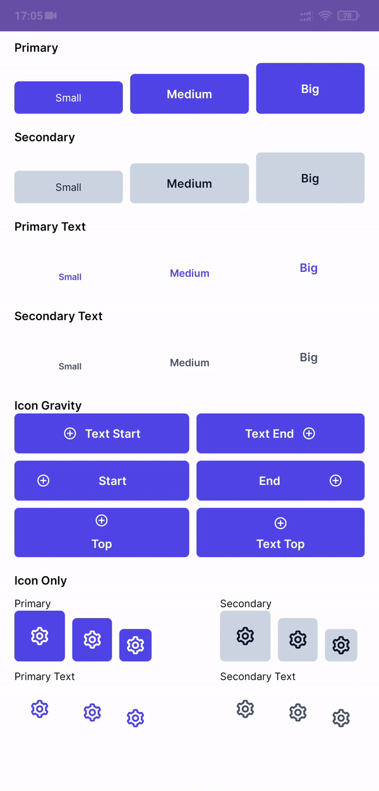

# Buttons

 

*   [Size](#size)
*   [Style](#style)
*   
*   [Style](#style)

## Size
| Size      | Minimal Height      | Text Appearance |
| --------- | ------------------- | --------------- |
| Small     | 36dp                | `@style/subtitle`|
| Medium    | 44dp                | `@style/body`  |
| Big       | 56dp                | `@style/body`  |

## Style

## Primary ##
 
In the layout:
```xml
<Button
  ...
  style="@style/PrimaryButton.Small"
/>
<Button
  ...
  style="@style/PrimaryButton.Medium"
/>
<Button
  ...
  style="@style/PrimaryButton.Big"
/>
```
