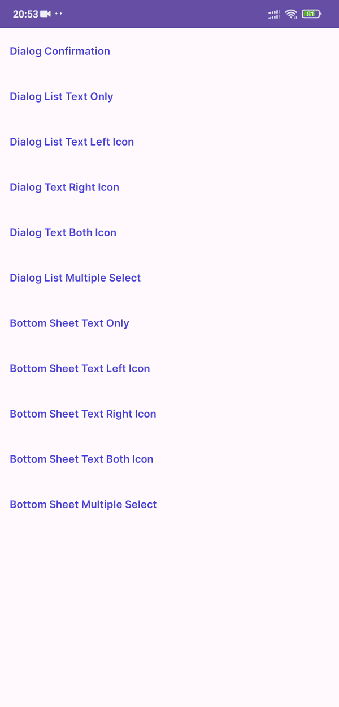
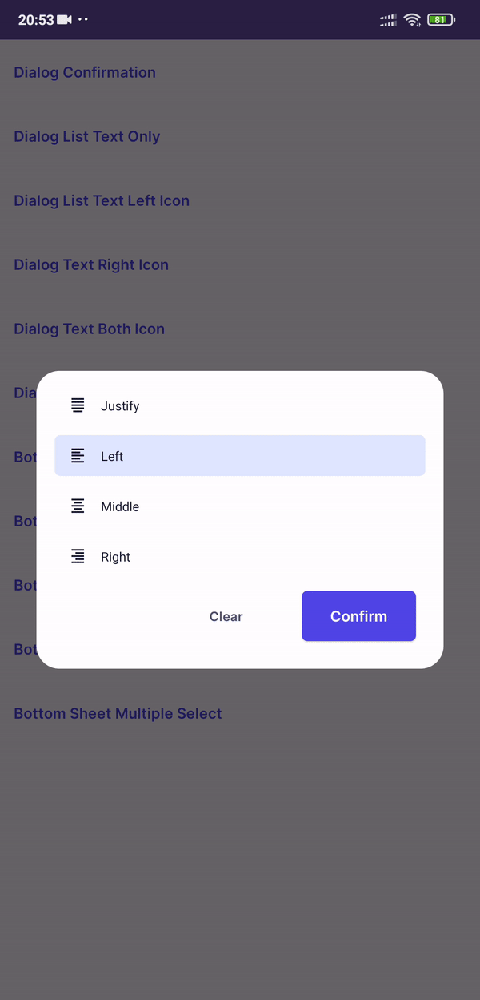
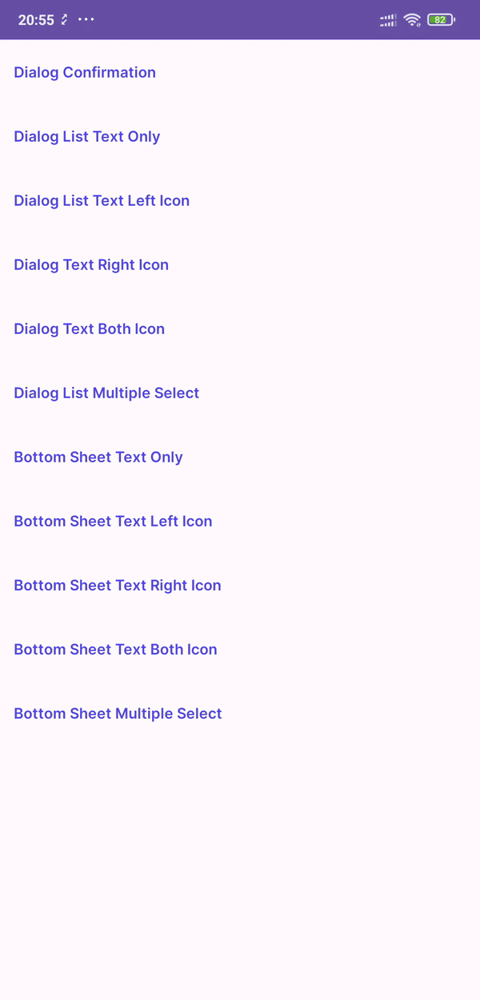
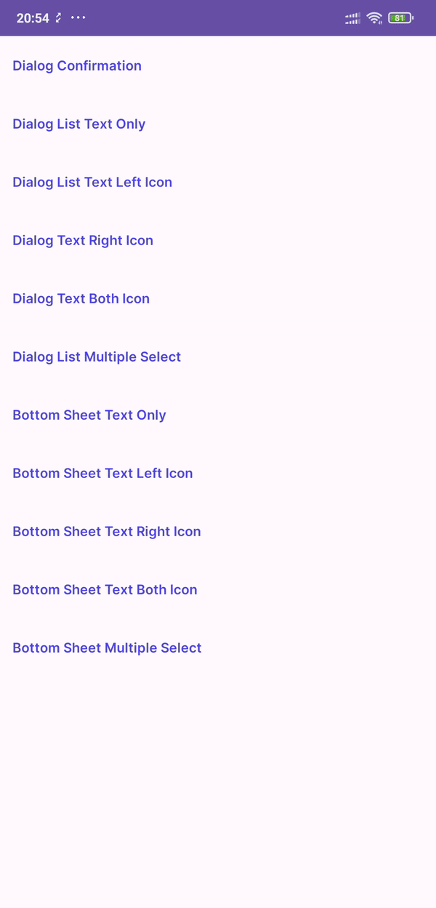
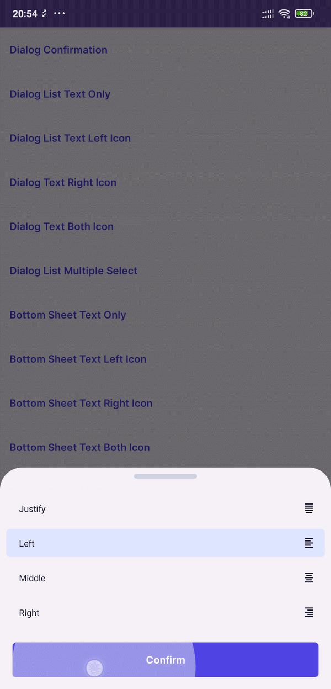

# Dialogs
**Contents**

*   [Create Custom List](#create-custom-list)
*   [Dialog Confirmation](#dialog-confirmation)
*   [Dialog List](#dialog_list)
*   [Dialog List Multiple](#dialog_list_multiple_select)
*   [Bottom Sheet List](#bottom-sheet-list)
*   [Bottom Sheet List Multiple Select](#bottom-sheet-list_multiple_select)

## Create Custom List

```kt
import com.dimasbintang.design_system.helper.DropdownMapper.addItemDropdown
import com.dimasbintang.design_system.helper.BoxiconMapper.getDrawableBoxicon
import com.dimasbintang.design_system.model.ItemDropdown

val items = arrayListOf<ItemDropdown>()
items.addItemDropdown("Alarm") // item only contains text
items.addItemDropdown("Alarm", getDrawableBoxicon(this, "bx_alarm")) // item with start icon
items.addItemDropdown("Alarm", null, getDrawableBoxicon(this, "bx_alarm")) // item with end icon
items.addItemDropdown("Alarm", getDrawableBoxicon(this, "bx_alarm"), getDrawableBoxicon(this, "bx_plus")) // item with both start and end icon
// getDrawableBoxicon(this, "icon_name")) function for get drawable by name
```

## Dialog Confirmation
 

In the code:
```kt
val dialog = DialogConfirmation("Title", "Message dialog confirmation", "Confirm", "Cancel")
dialog.positiveListener = {
    // action positive button got click
    dialog.dismiss()
}
dialog.negativeListener = {
    // action positive button got click
    dialog.dismiss()
}
dialog.show(supportFragmentManager, null)
```

## Dialog List 
Text Only | Left Icon | Right Icon | Both Icon
------ | ------ | ------ | ------
 |  |  | 

In the code:
```kt
val dialog = ListDialog(this, items, false)
dialog.confirmListener = {
    // action positive button got click
}
dialog.show(supportFragmentManager, null)
```

## Dialog List Multiple Select
 

In the code:
```kt
val dialog = ListDialog(this, items, true)
dialog.confirmListener = {
    // action positive button got click
}
dialog.show(supportFragmentManager, null)
```

## Bottom Sheet List
Text Only | Left Icon | Right Icon | Both Icon
------ | ------ | ------ | ------
 |  |  | 

In the code:
```kt
val bottomSheet = ListBottomSheet(this, items, false)
bottomSheet.confirmListener = {
    // action positive button got click
}
bottomSheet.show(supportFragmentManager, null)
```

## Bottom Sheet List Multiple Select
 

In the code:
```kt
val bottomSheet = ListBottomSheet(this, items, true)
bottomSheet.confirmListener = {
    // action positive button got click
}
bottomSheet.show(supportFragmentManager, null)
```
