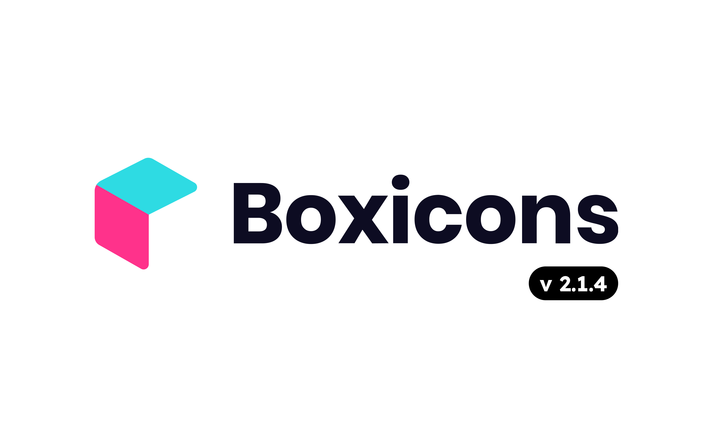

# Icons

This library utilizes the Boxicon icon pack to enhance the user interface's visual elements. Boxicon is a collection of simple vector icons designed specifically for Android app development. With its clean and diverse design, Boxicon provides a wide range of icons that can be seamlessly integrated into your project. For more information about Boxicon, visit the [official website](https://boxicons.com/).

## Regular
| Icon name             | Reference name              |
|-----------------------|------------------------|
| abacus                | `bx_abacus.xml`        |
| accessibility         | `bx_accessibility.xml` |
| add_to_queue          | `bx_add_to_queue.xml`  |
| adjust                | `bx_adjust.xml`        |
| alarm                 | `bx_alarm.xml`         |
| alarm_add             | `bx_alarm_add.xml`     |
| alarm_exclamation     | `bx_alarm_exclamation.xml` |
| alarm_off             | `bx_alarm_off.xml`     |
| alarm_snooze          | `bx_alarm_snooze.xml`  |
| album                 | `bx_album.xml`         |
| align_justify         | `bx_align_justify.xml` |
| align_left            | `bx_align_left.xml`    |
| align_middle          | `bx_align_middle.xml`  |
| align_right           | `bx_align_right.xml`   |
| analyse               | `bx_analyse.xml`       |
| anchor                | `bx_anchor.xml`        |
| angry                 | `bx_angry.xml`         |
| aperture              | `bx_aperture.xml`      |
| arch                  | `bx_arch.xml`          |
| archive               | `bx_archive.xml`       |
| archive_in            | `bx_archive_in.xml`    |
| archive_out           | `bx_archive_out.xml`   |
| area                  | `bx_area.xml`          |
| arrow_back            | `bx_arrow_back.xml`    |
| arrow_from_bottom     | `bx_arrow_from_bottom.xml` |
| arrow_from_left       | `bx_arrow_from_left.xml` |
| arrow_from_right      | `bx_arrow_from_right.xml` |
| arrow_from_top        | `bx_arrow_from_top.xml` |
| arrow_to_bottom       | `bx_arrow_to_bottom.xml` |
| arrow_to_left         | `bx_arrow_to_left.xml` |
| arrow_to_right        | `bx_arrow_to_right.xml` |
| arrow_to_top          | `bx_arrow_to_top.xml`  |
| at                    | `bx_at.xml`            |
| atom                  | `bx_atom.xml`          |
| award                 | `bx_award.xml`         |
| badge                 | `bx_badge.xml`         |
| badge_check           | `bx_badge_check.xml`   |
| baguette              | `bx_baguette.xml`      |
| ball                  | `bx_ball.xml`          |
| band_aid              | `bx_band_aid.xml`      |
| barcode               | `bx_barcode.xml`       |
| barcode_reader        | `bx_barcode_reader.xml` |
| bar_chart             | `bx_bar_chart.xml`     |
| bar_chart_alt         | `bx_bar_chart_alt.xml` |
| bar_chart_alt_2       | `bx_bar_chart_alt_2.xml` |
| bar_chart_square      | `bx_bar_chart_square.xml` |
| baseball              | `bx_baseball.xml`      |
| basket                | `bx_basket.xml`        |
| basketball            | `bx_basketball.xml`    |
| bath                  | `bx_bath.xml`          |
| battery               | `bx_battery.xml`       |
| bed                   | `bx_bed.xml`           |
| been_here             | `bx_been_here.xml`     |
| beer                  | `bx_beer.xml`          |
| bell                  | `bx_bell.xml`          |
| bell_minus            | `bx_bell_minus.xml`    |
| bell_off              | `bx_bell_off.xml`      |
| bell_plus             | `bx_bell_plus.xml`     |
| bible                 | `bx_bible.xml`         |
| bitcoin               | `bx_bitcoin.xml`       |
| blanket               | `bx_blanket.xml`       |
| block                 | `bx_block.xml`         |
| bluetooth             | `bx_bluetooth.xml`     |
| body                  | `bx_body.xml`          |
| bold                  | `bx_bold.xml`          |
| bolt_circle           | `bx_bolt_circle.xml`   |
| bomb                  | `bx_bomb.xml`          |
| bone                  | `bx_bone.xml`          |
| bong                  | `bx_bong.xml`          |
| book                  | `bx_book.xml`          |
| bookmark              | `bx_bookmark.xml`      |
| bookmarks             | `bx_bookmarks.xml`     |
| bookmark_alt          | `bx_bookmark_alt.xml`  |
| bookmark_alt_minus    | `bx_bookmark_alt_minus.xml` |
| bookmark_alt_plus     | `bx_bookmark_alt_plus.xml` |
| bookmark_heart        | `bx_bookmark_heart.xml` |
| bookmark_minus        | `bx_bookmark_minus.xml` |
| bookmark_plus         | `bx_bookmark_plus.xml` |
| book_add              | `bx_book_add.xml`      |
| book_alt              | `bx_book_alt.xml`      |
| book_bookmark         | `bx_book_bookmark.xml` |
| book_content          | `bx_book_content.xml`  |
| book_heart            | `bx_book_heart.xml`    |
| book_open             | `bx_book_open.xml`     |
| book_reader           | `bx_book_reader.xml`   |
| border_all            | `bx_border_all.xml`    |
| border_bottom         | `bx_border_bottom.xml` |
| border_inner          | `bx_border_inner.xml`  |
| border_left           | `bx_border_left.xml`   |
| border_none           | `bx_border_none.xml`   |
| border_outer          | `bx_border_outer.xml`  |
| border_radius         | `bx_border_radius.xml` |
| border_right          | `bx_border_right.xml`  |
| border_top            | `bx_border_top.xml`    |
| bot                   | `bx_bot.xml`           |
| bowling_ball          | `bx_bowling_ball.xml`  |
| bowl_hot              | `bx_bowl_hot.xml`      |
| bowl_rice             | `bx_bowl_rice.xml`     |
| box                   | `bx_box.xml`           |
| bracket               | `bx_bracket.xml`       |
| braille               | `bx_braille.xml`       |
| brain                 | `bx_brain.xml`         |
| briefcase             | `bx_briefcase.xml`     |
| briefcase_alt         | `bx_briefcase_alt.xml` |
| briefcase_alt_2       | `bx_briefcase_alt_2.xml` |
| brightness            | `bx_brightness.xml`    |
| brightness_half       | `bx_brightness_half.xml` |
| broadcast             | `bx_broadcast.xml`     |
| brush                 | `bx_brush.xml`         |
| brush_alt             | `bx_brush_alt.xml`     |
| bug                   | `bx_bug.xml`           |
| bug_alt               | `bx_bug_alt.xml`       |
| building              | `bx_building.xml`      |
| buildings             | `bx_buildings.xml`     |
| building_house        | `bx_building_house.xml` |
| bulb                  | `bx_bulb.xml`          |
| bullseye              | `bx_bullseye.xml`      |
| buoy                  | `bx_buoy.xml`          |
| bus                   | `bx_bus.xml`           |
| bus_school            | `bx_bus_school.xml`    |
| cabinet               | `bx_cabinet.xml`       |
| cable_car             | `bx_cable_car.xml`     |
| cake                  | `bx_cake.xml`          |
| calculator            | `bx_calculator.xml`    |
| calendar              | `bx_calendar.xml`      |
| calendar_alt          | `bx_calendar_alt.xml`  |
| calendar_check        | `bx_calendar_check.xml` |
| calendar_edit         | `bx_calendar_edit.xml` |
| calendar_event        | `bx_calendar_event.xml` |
| calendar_exclamation  | `bx_calendar_exclamation.xml` |
| calendar_heart        | `bx_calendar_heart.xml` |
| calendar_minus        | `bx_calendar_minus.xml` |
| calendar_plus         | `bx_calendar_plus.xml` |
| calendar_star         | `bx_calendar_star.xml` |
| calendar_week         | `bx_calendar_week.xml` |
| calendar_x            | `bx_calendar_x.xml`    |
| camera                | `bx_camera.xml`        |
| camera_home           | `bx_camera_home.xml`   |
| camera_movie          | `bx_camera_movie.xml`  |
| camera_off            | `bx_camera_off.xml`    |
| candles               | `bx_candles.xml`       |
| capsule               | `bx_capsule.xml`       |
| captions              | `bx_captions.xml`      |
| car                   | `bx_car.xml`           |
| card                  | `bx_card.xml`          |
| caret_down            | `bx_caret_down.xml`    |
| caret_down_circle     | `bx_caret_down_circle.xml` |
| caret_down_square     | `bx_caret_down_square.xml` |
| caret_left            | `bx_caret_left.xml`    |
| caret_left_circle     | `bx_caret_left_circle.xml` |
| caret_left_square     | `bx_caret_left_square.xml` |
| caret_right           | `bx_caret_right.xml`   |
| caret_right_circle    | `bx_caret_right_circle.xml` |
| caret_right_square    | `bx_caret_right_square.xml` |
| caret_up              | `bx_caret_up.xml`      |
| caret_up_circle       | `bx_caret_up_circle.xml` |
| caret_up_square       | `bx_caret_up_square.xml` |
| carousel              | `bx_carousel.xml`      |
| cart                  | `bx_cart.xml`          |
| cart_add              | `bx_cart_add.xml`      |
| cart_alt              | `bx_cart_alt.xml`      |
| cart_download         | `bx_cart_download.xml` |
| cast                  | `bx_cast.xml`          |
| category              | `bx_category.xml`      |
| category_alt          | `bx_category_alt.xml`  |
| cctv                  | `bx_cctv.xml`          |
| certification         | `bx_certification.xml` |
| chair                 | `bx_chair.xml`         |
| chalkboard            | `bx_chalkboard.xml`    |
| chart                 | `bx_chart.xml`         |
| chat                  | `bx_chat.xml`          |
| check                 | `bx_check.xml`         |
| checkbox              | `bx_checkbox.xml`      |
| checkbox_checked      | `bx_checkbox_checked.xml` |
| checkbox_minus        | `bx_checkbox_minus.xml` |
| checkbox_square       | `bx_checkbox_square.xml` |
| check_circle          | `bx_check_circle.xml`  |
| check_double          | `bx_check_double.xml`  |
| check_shield          | `bx_check_shield.xml`  |
| check_square          | `bx_check_square.xml`  |
| cheese                | `bx_cheese.xml`        |
| chevrons_down         | `bx_chevrons_down.xml` |
| chevrons_left         | `bx_chevrons_left.xml` |
| chevrons_right        | `bx_chevrons_right.xml` |
| chevrons_up           | `bx_chevrons_up.xml`   |
| chevron_down          | `bx_chevron_down.xml`  |
| chevron_down_circle   | `bx_chevron_down_circle.xml` |
| chevron_down_square   | `bx_chevron_down_square.xml` |
| chevron_left          | `bx_chevron_left.xml`  |
| chevron_left_circle   | `bx_chevron_left_circle.xml` |
| chevron_left_square   | `bx_chevron_left_square.xml` |
| chevron_right         | `bx_chevron_right.xml` |
| chevron_right_circle  | `bx_chevron_right_circle.xml` |
| chevron_right_square  | `bx_chevron_right_square.xml` |
| chevron_up            | `bx_chevron_up.xml`    |
| chevron_up_circle     | `bx_chevron_up_circle.xml` |
| chevron_up_square     | `bx_chevron_up_square.xml` |
| child                 | `bx_child.xml`         |
| chip                  | `bx_chip.xml`          |
| church                | `bx_church.xml`        |
| circle                | `bx_circle.xml`        |
| circle_half           | `bx_circle_half.xml`   |
| circle_quarter        | `bx_circle_quarter.xml` |
| circle_three_quarter  | `bx_circle_three_quarter.xml` |
| clinic                | `bx_clinic.xml`        |
| clipboard             | `bx_clipboard.xml`     |
| closet                | `bx_closet.xml`        |
| cloud                 | `bx_cloud.xml`         |
| cloud_download        | `bx_cloud_download.xml` |
| cloud_drizzle         | `bx_cloud_drizzle.xml` |
| cloud_lightning       | `bx_cloud_lightning.xml` |
| cloud_light_rain      | `bx_cloud_light_rain.xml` |
| cloud_rain            | `bx_cloud_rain.xml`    |
| cloud_snow            | `bx_cloud_snow.xml`    |
| cloud_upload          | `bx_cloud_upload.xml`  |
| code                  | `bx_code.xml`          |
| code_alt              | `bx_code_alt.xml`      |
| code_block            | `bx_code_block.xml`    |
| code_curly            | `bx_code_curly.xml`    |
| coffee                | `bx_coffee.xml`        |
| coffee_togo           | `bx_coffee_togo.xml`   |
| cog                   | `bx_cog.xml`           |
| coin                  | `bx_coin.xml`          |
| coin_stack            | `bx_coin_stack.xml`    |
| collapse              | `bx_collapse.xml`      |
| collapse_alt          | `bx_collapse_alt.xml`  |
| collapse_horizontal   | `bx_collapse_horizontal.xml` |
| collapse_vertical     | `bx_collapse_vertical.xml` |
| collection            | `bx_collection.xml`    |
| color                 | `bx_color.xml`         |
| color_fill            | `bx_color_fill`         |
| columns            | `bx_columns.xml`         |
| command            | `bx_command.xml`         |
| comment            | `bx_comment.xml`         |
| comment_add            | `bx_comment_add.xml`         |
| comment_check            | `bx_comment_check.xml`         |
| comment_detail            | `bx_comment_detail.xml`         |
| comment_dots            | `bx_comment_dots.xml`         |
| comment_edit            | `bx_comment_edit.xml`         |
| comment_error            | `bx_comment_error.xml`         |
| comment_minus            | `bx_comment_minus.xml`         |
| comment_x            | `bx_comment_x.xml`         |
| compass            | `bx_compass.xml`         |
| confused            | `bx_confused.xml`         |
| conversation            | `bx_conversation.xml`         |
| cookie            | `bx_cookie.xml`         |
| cool            | `bx_cool.xml`         |
| copy            | `bx_copy.xml`         |
| copyright            | `bx_copyright.xml`         |
| copy_alt            | `bx_copy_alt.xml`         |
| credit_card            | `bx_credit_card.xml`         |
| credit_card_alt            | `bx_credit_card_alt.xml`         |
| credit_card_front            | `bx_credit_card_front.xml`         |
| cricket_ball            | `bx_cricket_ball.xml`         |
| crop            | `bx_crop.xml`         |
| cross            | `bx_cross.xml`         |
| crosshair            | `bx_crosshair.xml`         |
| crown            | `bx_crown.xml`         |
| cube            | `bx_cube.xml`         |
| cube_alt            | `bx_cube_alt.xml`         |
| cuboid            | `bx_cuboid.xml`         |
| current_location            | `bx_current_location.xml`         |
| customize            | `bx_customize.xml`         |
| cut            | `bx_cut.xml`         |
| cycling            | `bx_cycling.xml`         |
| cylinder            | `bx_cylinder.xml`         |
| data            | `bx_data.xml`         |
| desktop            | `bx_desktop.xml`         |
| detail            | `bx_detail.xml`         |
| devices            | `bx_devices.xml`         |
| dialpad            | `bx_dialpad.xml`         |
| dialpad_alt            | `bx_dialpad_alt.xml`         |
| diamond            | `bx_diamond.xml`         |
| dice_1            | `bx_dice_1.xml`         |
| dice_2            | `bx_dice_2.xml`         |
| dice_3            | `bx_dice_3.xml`         |
| dice_4            | `bx_dice_4.xml`         |
| dice_5            | `bx_dice_5.xml`         |
| dice_6            | `bx_dice_6.xml`         |
| directions            | `bx_directions.xml`         |
| disc            | `bx_disc.xml`         |
| dish            | `bx_dish.xml`         |
| dislike            | `bx_dislike.xml`         |
| dizzy            | `bx_dizzy.xml`         |
| dna            | `bx_dna.xml`         |
| dock_bottom            | `bx_dock_bottom.xml`         |
| dock_left            | `bx_dock_left.xml`         |
| dock_right            | `bx_dock_right.xml`         |
| dock_top            | `bx_dock_top.xml`         |
| dollar            | `bx_dollar.xml`         |
| dollar_circle            | `bx_dollar_circle.xml`         |
| donate_blood            | `bx_donate_blood.xml`         |
| donate_heart            | `bx_donate_heart.xml`         |
| door_open            | `bx_door_open.xml`         |
| dots_horizontal            | `bx_dots_horizontal.xml`         |
| dots_horizontal_rounded            | `bx_dots_horizontal_rounded.xml`         |
| dots_vertical            | `bx_dots_vertical.xml`         |
| dots_vertical_rounded            | `bx_dots_vertical_rounded.xml`         |
| doughnut_chart            | `bx_doughnut_chart.xml`         |
| download            | `bx_download.xml`         |
| downvote            | `bx_downvote.xml`         |
| down_arrow            | `bx_down_arrow.xml`         |
| down_arrow_alt            | `bx_down_arrow_alt.xml`         |
| down_arrow_circle            | `bx_down_arrow_circle.xml`         |
| drink            | `bx_drink.xml`         |
| droplet            | `bx_droplet.xml`         |
| dumbbell            | `bx_dumbbell.xml`         |
| duplicate            | `bx_duplicate.xml`         |
| edit            | `bx_edit.xml`         |
| edit_alt            | `bx_edit_alt.xml`         |
| envelope            | `bx_envelope.xml`         |
| envelope_open            | `bx_envelope_open.xml`         |
| equalizer            | `bx_equalizer.xml`         |
| eraser            | `bx_eraser.xml`         |
| error            | `bx_error.xml`         |
| error_alt            | `bx_error_alt.xml`         |
| error_circle            | `bx_error_circle.xml`         |
| euro            | `bx_euro.xml`         |
| exclude            | `bx_exclude.xml`         |
| exit            | `bx_exit.xml`         |
| exit_fullscreen            | `bx_exit_fullscreen.xml`         |
| expand            | `bx_expand.xml`         |
| expand_alt            | `bx_expand_alt.xml`         |
| expand_horizontal            | `bx_expand_horizontal.xml`         |
| expand_vertical            | `bx_expand_vertical.xml`         |
| export            | `bx_export.xml`         |
| extension            | `bx_extension.xml`         |
| face            | `bx_face.xml`         |
| fast_forward            | `bx_fast_forward.xml`         |
| fast_forward_circle            | `bx_fast_forward_circle.xml`         |
| female            | `bx_female.xml`         |
| female_sign            | `bx_female_sign.xml`         |
| file            | `bx_file.xml`         |
| file_blank            | `bx_file_blank.xml`         |
| file_find            | `bx_file_find.xml`         |
| film            | `bx_film.xml`         |
| filter            | `bx_filter.xml`         |
| filter_alt            | `bx_filter_alt.xml`         |
| fingerprint            | `bx_fingerprint.xml`         |
| first_aid            | `bx_first_aid.xml`         |
| first_page            | `bx_first_page.xml`         |
| flag            | `bx_flag.xml`         |
| folder            | `bx_folder.xml`         |
| folder_minus            | `bx_folder_minus.xml`         |
| folder_open            | `bx_folder_open.xml`         |
| folder_plus            | `bx_folder_plus.xml`         |
| font            | `bx_font.xml`         |
| font_color            | `bx_font_color.xml`         |
| font_family            | `bx_font_family.xml`         |
| font_size            | `bx_font_size.xml`         |
| food_menu            | `bx_food_menu.xml`         |
| food_tag            | `bx_food_tag.xml`         |
| football            | `bx_football.xml`         |
| fork            | `bx_fork.xml`         |
| fridge            | `bx_fridge.xml`         |
| fullscreen            | `bx_fullscreen.xml`         |
| game            | `bx_game.xml`         |
| gas_pump            | `bx_gas_pump.xml`         |
| ghost            | `bx_ghost.xml`         |
| gift            | `bx_gift.xml`         |
| git_branch            | `bx_git_branch.xml`         |
| git_commit            | `bx_git_commit.xml`         |
| git_compare            | `bx_git_compare.xml`         |
| git_merge            | `bx_git_merge.xml`         |
| git_pull_request            | `bx_git_pull_request.xml`         |
| git_repo_forked            | `bx_git_repo_forked.xml`         |
| glasses            | `bx_glasses.xml`         |
| glasses_alt            | `bx_glasses_alt.xml`         |
| globe            | `bx_globe.xml`         |
| globe_alt            | `bx_globe_alt.xml`         |
| grid            | `bx_grid.xml`         |
| grid_alt            | `bx_grid_alt.xml`         |
| grid_horizontal            | `bx_grid_horizontal.xml`         |
| grid_small            | `bx_grid_small.xml`         |
| grid_vertical            | `bx_grid_vertical.xml`         |
| group            | `bx_group.xml`         |
| handicap            | `bx_handicap.xml`         |
| happy            | `bx_happy.xml`         |
| happy_alt            | `bx_happy_alt.xml`         |
| happy_beaming            | `bx_happy_beaming.xml`         |
| happy_heart_eyes            | `bx_happy_heart_eyes.xml`         |
| hard_hat            | `bx_hard_hat.xml`         |
| hash            | `bx_hash.xml`         |
| hdd            | `bx_hdd.xml`         |
| heading            | `bx_heading.xml`         |
| headphone            | `bx_headphone.xml`         |
| health            | `bx_health.xml`         |
| heart            | `bx_heart.xml`         |
| heart_circle            | `bx_heart_circle.xml`         |
| heart_square            | `bx_heart_square.xml`         |
| help_circle            | `bx_help_circle.xml`         |
| hide            | `bx_hide.xml`         |
| highlight            | `bx_highlight.xml`         |
| history            | `bx_history.xml`         |
| hive            | `bx_hive.xml`         |
| home            | `bx_home.xml`         |
| home_alt            | `bx_home_alt.xml`         |
| home_alt_2            | `bx_home_alt_2.xml`         |
| home_circle            | `bx_home_circle.xml`         |
| home_heart            | `bx_home_heart.xml`         |
| home_smile            | `bx_home_smile.xml`         |
| horizontal_center            | `bx_horizontal_center.xml`         |
| horizontal_left            | `bx_horizontal_left.xml`         |
| horizontal_right            | `bx_horizontal_right.xml`         |
| hotel            | `bx_hotel.xml`         |
| hourglass            | `bx_hourglass.xml`         |
| id_card            | `bx_id_card.xml`         |
| image            | `bx_image.xml`         |
| images            | `bx_images.xml`         |
| image_add            | `bx_image_add.xml`         |
| image_alt            | `bx_image_alt.xml`         |
| import            | `bx_import.xml`         |
| infinite            | `bx_infinite.xml`         |
| info_circle            | `bx_info_circle.xml`         |
| info_square            | `bx_info_square.xml`         |
| injection            | `bx_injection.xml`         |
| intersect            | `bx_intersect.xml`         |
| italic            | `bx_italic.xml`         |
| joystick            | `bx_joystick.xml`         |
| joystick_alt            | `bx_joystick_alt.xml`         |
| joystick_button            | `bx_joystick_button.xml`         |
| key            | `bx_key.xml`         |
| knife            | `bx_knife.xml`         |
| label            | `bx_label.xml`         |
| landscape            | `bx_landscape.xml`         |
| laptop            | `bx_laptop.xml`         |
| last_page            | `bx_last_page.xml`         |
| laugh            | `bx_laugh.xml`         |
| layer            | `bx_layer.xml`         |
| layer_minus            | `bx_layer_minus.xml`         |
| layer_plus            | `bx_layer_plus.xml`         |
| layout            | `bx_layout.xml`         |
| leaf            | `bx_leaf.xml`         |
| left_arrow            | `bx_left_arrow.xml`         |
| left_arrow_alt            | `bx_left_arrow_alt.xml`         |
| left_arrow_circle            | `bx_left_arrow_circle.xml`         |
| left_down_arrow_circle            | `bx_left_down_arrow_circle.xml`         |
| left_indent            | `bx_left_indent.xml`         |
| left_top_arrow_circle            | `bx_left_top_arrow_circle.xml`         |
| lemon            | `bx_lemon.xml`         |
| library            | `bx_library.xml`         |
| like            | `bx_like.xml`         |
| line_chart            | `bx_line_chart.xml`         |
| line_chart_down            | `bx_line_chart_down.xml`         |
| link            | `bx_link.xml`         |
| link_alt            | `bx_link_alt.xml`         |
| link_external            | `bx_link_external.xml`         |
| lira            | `bx_lira.xml`         |
| list_check            | `bx_list_check.xml`         |
| list_minus            | `bx_list_minus.xml`         |
| list_ol            | `bx_list_ol.xml`         |
| list_plus            | `bx_list_plus.xml`         |
| list_ul            | `bx_list_ul.xml`         |
| loader            | `bx_loader.xml`         |
| loader_alt            | `bx_loader_alt.xml`         |
| loader_circle            | `bx_loader_circle.xml`         |
| location_plus            | `bx_location_plus.xml`         |
| lock            | `bx_lock.xml`         |
| lock_alt            | `bx_lock_alt.xml`         |
| lock_open            | `bx_lock_open.xml`         |
| lock_open_alt            | `bx_lock_open_alt.xml`         |
| log_in            | `bx_log_in.xml`         |
| log_in_circle            | `bx_log_in_circle.xml`         |
| log_out            | `bx_log_out.xml`         |
| log_out_circle            | `bx_log_out_circle.xml`         |
| low_vision            | `bx_low_vision.xml`         |
| magnet            | `bx_magnet.xml`         |
| mail_send            | `bx_mail_send.xml`         |
| male            | `bx_male.xml`         |
| male_female            | `bx_male_female.xml`         |
| male_sign            | `bx_male_sign.xml`         |
| map            | `bx_map.xml`         |
| map_alt            | `bx_map_alt.xml`         |
| map_pin            | `bx_map_pin.xml`         |
| mask            | `bx_mask.xml`         |
| math            | `bx_math.xml`         |
| medal            | `bx_medal.xml`         |
| meh            | `bx_meh.xml`         |
| meh_alt            | `bx_meh_alt.xml`         |
| meh_blank            | `bx_meh_blank.xml`         |
| memory_card            | `bx_memory_card.xml`         |
| menu            | `bx_menu.xml`         |
| menu_alt_left            | `bx_menu_alt_left.xml`         |
| menu_alt_right            | `bx_menu_alt_right.xml`         |
| merge            | `bx_merge.xml`         |
| message            | `bx_message.xml`         |
| message_add            | `bx_message_add.xml`         |
| message_alt            | `bx_message_alt.xml`         |
| message_alt_add            | `bx_message_alt_add.xml`         |
| message_alt_check            | `bx_message_alt_check.xml`         |
| message_alt_detail            | `bx_message_alt_detail.xml`         |
| message_alt_dots            | `bx_message_alt_dots.xml`         |
| message_alt_edit            | `bx_message_alt_edit.xml`         |
| message_alt_error            | `bx_message_alt_error.xml`         |
| message_alt_minus            | `bx_message_alt_minus.xml`         |
| message_alt_x            | `bx_message_alt_x.xml`         |
| message_check            | `bx_message_check.xml`         |
| message_detail            | `bx_message_detail.xml`         |
| message_dots            | `bx_message_dots.xml`         |
| message_edit            | `bx_message_edit.xml`         |
| message_error            | `bx_message_error.xml`         |
| message_minus            | `bx_message_minus.xml`         |
| message_rounded            | `bx_message_rounded.xml`         |
| message_rounded_add            | `bx_message_rounded_add.xml`         |
| message_rounded_check            | `bx_message_rounded_check.xml`         |
| message_rounded_detail            | `bx_message_rounded_detail.xml`         |
| message_rounded_dots            | `bx_message_rounded_dots.xml`         |
| message_rounded_edit            | `bx_message_rounded_edit.xml`         |
| message_rounded_error            | `bx_message_rounded_error.xml`         |
| message_rounded_minus            | `bx_message_rounded_minus.xml`         |
| message_rounded_x            | `bx_message_rounded_x.xml`         |
| message_square            | `bx_message_square.xml`         |
| message_square_add            | `bx_message_square_add.xml`         |
| message_square_check            | `bx_message_square_check.xml`         |
| message_square_detail            | `bx_message_square_detail.xml`         |
| message_square_dots            | `bx_message_square_dots.xml`         |
| message_square_edit            | `bx_message_square_edit.xml`         |
| message_square_error            | `bx_message_square_error.xml`         |
| message_square_minus            | `bx_message_square_minus.xml`         |
| message_square_x            | `bx_message_square_x.xml`         |
| message_x            | `bx_message_x.xml`         |
| meteor            | `bx_meteor.xml`         |
| microchip            | `bx_microchip.xml`         |
| microphone            | `bx_microphone.xml`         |
| microphone_off            | `bx_microphone_off.xml`         |
| minus            | `bx_minus.xml`         |
| minus_back            | `bx_minus_back.xml`         |
| minus_circle            | `bx_minus_circle.xml`         |
| minus_front            | `bx_minus_front.xml`         |
| mobile            | `bx_mobile.xml`         |
| mobile_alt            | `bx_mobile_alt.xml`         |
| mobile_landscape            | `bx_mobile_landscape.xml`         |
| mobile_vibration            | `bx_mobile_vibration.xml`         |
| money            | `bx_money.xml`         |
| money_withdraw            | `bx_money_withdraw.xml`         |
| moon            | `bx_moon.xml`         |
| mouse            | `bx_mouse.xml`         |
| mouse_alt            | `bx_mouse_alt.xml`         |
| move            | `bx_move.xml`         |
| move_horizontal            | `bx_move_horizontal.xml`         |
| move_vertical            | `bx_move_vertical.xml`         |
| movie            | `bx_movie.xml`         |
| movie_play            | `bx_movie_play.xml`         |
| music            | `bx_music.xml`         |
| navigation            | `bx_navigation.xml`         |
| network_chart            | `bx_network_chart.xml`         |
| news            | `bx_news.xml`         |
| note            | `bx_note.xml`         |
| notepad            | `bx_notepad.xml`         |
| notification            | `bx_notification.xml`         |
| notification_off            | `bx_notification_off.xml`         |
| no_entry            | `bx_no_entry.xml`         |
| no_signal            | `bx_no_signal.xml`         |
| objects_horizontal_center            | `bx_objects_horizontal_center.xml`         |
| objects_horizontal_left            | `bx_objects_horizontal_left.xml`         |
| objects_horizontal_right            | `bx_objects_horizontal_right.xml`         |
| objects_vertical_bottom            | `bx_objects_vertical_bottom.xml`         |
| objects_vertical_center            | `bx_objects_vertical_center.xml`         |
| objects_vertical_top            | `bx_objects_vertical_top.xml`         |
| outline            | `bx_outline.xml`         |
| package            | `bx_package.xml`         |
| paint            | `bx_paint.xml`         |
| paint_roll            | `bx_paint_roll.xml`         |
| palette            | `bx_palette.xml`         |
| paperclip            | `bx_paperclip.xml`         |
| paper_plane            | `bx_paper_plane.xml`         |
| paragraph            | `bx_paragraph.xml`         |
| party            | `bx_party.xml`         |
| paste            | `bx_paste.xml`         |
| pause            | `bx_pause.xml`         |
| pause_circle            | `bx_pause_circle.xml`         |
| pen            | `bx_pen.xml`         |
| pencil            | `bx_pencil.xml`         |
| phone            | `bx_phone.xml`         |
| phone_call            | `bx_phone_call.xml`         |
| phone_incoming            | `bx_phone_incoming.xml`         |
| phone_off            | `bx_phone_off.xml`         |
| phone_outgoing            | `bx_phone_outgoing.xml`         |
| photo_album            | `bx_photo_album.xml`         |
| pie_chart            | `bx_pie_chart.xml`         |
| pie_chart_alt            | `bx_pie_chart_alt.xml`         |
| pie_chart_alt_2            | `bx_pie_chart_alt_2.xml`         |
| pin            | `bx_pin.xml`         |
| planet            | `bx_planet.xml`         |
| play            | `bx_play.xml`         |
| play_circle            | `bx_play_circle.xml`         |
| plug            | `bx_plug.xml`         |
| plus            | `bx_plus.xml`         |
| plus_circle            | `bx_plus_circle.xml`         |
| plus_medical            | `bx_plus_medical.xml`         |
| podcast            | `bx_podcast.xml`         |
| pointer            | `bx_pointer.xml`         |
| poll            | `bx_poll.xml`         |
| polygon            | `bx_polygon.xml`         |
| popsicle            | `bx_popsicle.xml`         |
| pound            | `bx_pound.xml`         |
| power_off            | `bx_power_off.xml`         |
| printer            | `bx_printer.xml`         |
| pulse            | `bx_pulse.xml`         |
| purchase_tag            | `bx_purchase_tag.xml`         |
| purchase_tag_alt            | `bx_purchase_tag_alt.xml`         |
| pyramid            | `bx_pyramid.xml`         |
| qr            | `bx_qr.xml`         |
| qr_scan            | `bx_qr_scan.xml`         |
| question_mark            | `bx_question_mark.xml`         |
| radar            | `bx_radar.xml`         |
| radio            | `bx_radio.xml`         |
| radio_circle            | `bx_radio_circle.xml`         |
| radio_circle_marked            | `bx_radio_circle_marked.xml`         |
| receipt            | `bx_receipt.xml`         |
| rectangle            | `bx_rectangle.xml`         |
| recycle            | `bx_recycle.xml`         |
| redo            | `bx_redo.xml`         |
| reflect_horizontal            | `bx_reflect_horizontal.xml`         |
| reflect_vertical            | `bx_reflect_vertical.xml`         |
| refresh            | `bx_refresh.xml`         |
| registered            | `bx_registered.xml`         |
| rename            | `bx_rename.xml`         |
| repeat            | `bx_repeat.xml`         |
| reply            | `bx_reply.xml`         |
| reply_all            | `bx_reply_all.xml`         |
| repost            | `bx_repost.xml`         |
| reset            | `bx_reset.xml`         |
| restaurant            | `bx_restaurant.xml`         |
| revision            | `bx_revision.xml`         |
| rewind            | `bx_rewind.xml`         |
| rewind_circle            | `bx_rewind_circle.xml`         |
| rfid            | `bx_rfid.xml`         |
| right_arrow            | `bx_right_arrow.xml`         |
| right_arrow_alt            | `bx_right_arrow_alt.xml`         |
| right_arrow_circle            | `bx_right_arrow_circle.xml`         |
| right_down_arrow_circle            | `bx_right_down_arrow_circle.xml`         |
| right_indent            | `bx_right_indent.xml`         |
| right_top_arrow_circle            | `bx_right_top_arrow_circle.xml`         |
| rocket            | `bx_rocket.xml`         |
| rotate_left            | `bx_rotate_left.xml`         |
| rotate_right            | `bx_rotate_right.xml`         |
| rss            | `bx_rss.xml`         |
| ruble            | `bx_ruble.xml`         |
| ruler            | `bx_ruler.xml`         |
| run            | `bx_run.xml`         |
| rupee            | `bx_rupee.xml`         |
| sad            | `bx_sad.xml`         |
| save            | `bx_save.xml`         |
| scan            | `bx_scan.xml`         |
| scatter_chart            | `bx_scatter_chart.xml`         |
| screenshot            | `bx_screenshot.xml`         |
| search            | `bx_search.xml`         |
| search_alt            | `bx_search_alt.xml`         |
| search_alt_2            | `bx_search_alt_2.xml`         |
| selection            | `bx_selection.xml`         |
| select_multiple            | `bx_select_multiple.xml`         |
| send            | `bx_send.xml`         |
| server            | `bx_server.xml`         |
| shape_circle            | `bx_shape_circle.xml`         |
| shape_polygon            | `bx_shape_polygon.xml`         |
| shape_square            | `bx_shape_square.xml`         |
| shape_triangle            | `bx_shape_triangle.xml`         |
| share            | `bx_share.xml`         |
| share_alt            | `bx_share_alt.xml`         |
| shekel            | `bx_shekel.xml`         |
| shield            | `bx_shield.xml`         |
| shield_alt            | `bx_shield_alt.xml`         |
| shield_alt_2            | `bx_shield_alt_2.xml`         |
| shield_minus            | `bx_shield_minus.xml`         |
| shield_plus            | `bx_shield_plus.xml`         |
| shield_quarter            | `bx_shield_quarter.xml`         |
| shield_x            | `bx_shield_x.xml`         |
| shocked            | `bx_shocked.xml`         |
| shopping_bag            | `bx_shopping_bag.xml`         |
| show            | `bx_show.xml`         |
| shower            | `bx_shower.xml`         |
| show_alt            | `bx_show_alt.xml`         |
| shuffle            | `bx_shuffle.xml`         |
| sidebar            | `bx_sidebar.xml`         |
| signal_1            | `bx_signal_1.xml`         |
| signal_2            | `bx_signal_2.xml`         |
| signal_3            | `bx_signal_3.xml`         |
| signal_4            | `bx_signal_4.xml`         |
| signal_5            | `bx_signal_5.xml`         |
| sitemap            | `bx_sitemap.xml`         |
| skip_next            | `bx_skip_next.xml`         |
| skip_next_circle            | `bx_skip_next_circle.xml`         |
| skip_previous            | `bx_skip_previous.xml`         |
| skip_previous_circle            | `bx_skip_previous_circle.xml`         |
| sleepy            | `bx_sleepy.xml`         |
| slider            | `bx_slider.xml`         |
| slider_alt            | `bx_slider_alt.xml`         |
| slideshow            | `bx_slideshow.xml`         |
| smile            | `bx_smile.xml`         |
| sort            | `bx_sort.xml`         |
| sort_alt_2            | `bx_sort_alt_2.xml`         |
| sort_a_z            | `bx_sort_a_z.xml`         |
| sort_down            | `bx_sort_down.xml`         |
| sort_up            | `bx_sort_up.xml`         |
| sort_z_a            | `bx_sort_z_a.xml`         |
| spa            | `bx_spa.xml`         |
| space_bar            | `bx_space_bar.xml`         |
| speaker            | `bx_speaker.xml`         |
| spray_can            | `bx_spray_can.xml`         |
| spreadsheet            | `bx_spreadsheet.xml`         |
| square            | `bx_square.xml`         |
| square_rounded            | `bx_square_rounded.xml`         |
| star            | `bx_star.xml`         |
| station            | `bx_station.xml`         |
| stats            | `bx_stats.xml`         |
| sticker            | `bx_sticker.xml`         |
| stop            | `bx_stop.xml`         |
| stopwatch            | `bx_stopwatch.xml`         |
| stop_circle            | `bx_stop_circle.xml`         |
| store            | `bx_store.xml`         |
| store_alt            | `bx_store_alt.xml`         |
| street_view            | `bx_street_view.xml`         |
| strikethrough            | `bx_strikethrough.xml`         |
| subdirectory_left            | `bx_subdirectory_left.xml`         |
| subdirectory_right            | `bx_subdirectory_right.xml`         |
| sun            | `bx_sun.xml`         |
| support            | `bx_support.xml`         |
| sushi            | `bx_sushi.xml`         |
| swim            | `bx_swim.xml`         |
| sync            | `bx_sync.xml`         |
| tab            | `bx_tab.xml`         |
| table            | `bx_table.xml`         |
| tachometer            | `bx_tachometer.xml`         |
| tag            | `bx_tag.xml`         |
| tag_alt            | `bx_tag_alt.xml`         |
| target_lock            | `bx_target_lock.xml`         |
| task            | `bx_task.xml`         |
| task_x            | `bx_task_x.xml`         |
| taxi            | `bx_taxi.xml`         |
| tennis_ball            | `bx_tennis_ball.xml`         |
| terminal            | `bx_terminal.xml`         |
| test_tube            | `bx_test_tube.xml`         |
| text            | `bx_text.xml`         |
| time            | `bx_time.xml`         |
| timer            | `bx_timer.xml`         |
| time_five            | `bx_time_five.xml`         |
| tired            | `bx_tired.xml`         |
| toggle_left            | `bx_toggle_left.xml`         |
| toggle_right            | `bx_toggle_right.xml`         |
| tone            | `bx_tone.xml`         |
| traffic_cone            | `bx_traffic_cone.xml`         |
| train            | `bx_train.xml`         |
| transfer            | `bx_transfer.xml`         |
| transfer_alt            | `bx_transfer_alt.xml`         |
| trash            | `bx_trash.xml`         |
| trash_alt            | `bx_trash_alt.xml`         |
| trending_down            | `bx_trending_down.xml`         |
| trending_up            | `bx_trending_up.xml`         |
| trim            | `bx_trim.xml`         |
| trip            | `bx_trip.xml`         |
| trophy            | `bx_trophy.xml`         |
| tv            | `bx_tv.xml`         |
| underline            | `bx_underline.xml`         |
| undo            | `bx_undo.xml`         |
| unite            | `bx_unite.xml`         |
| universal_access            | `bx_universal_access.xml`         |
| unlink            | `bx_unlink.xml`         |
| upload            | `bx_upload.xml`         |
| upside_down            | `bx_upside_down.xml`         |
| upvote            | `bx_upvote.xml`         |
| up_arrow            | `bx_up_arrow.xml`         |
| up_arrow_alt            | `bx_up_arrow_alt.xml`         |
| up_arrow_circle            | `bx_up_arrow_circle.xml`         |
| usb            | `bx_usb.xml`         |
| user            | `bx_user.xml`         |
| user_check            | `bx_user_check.xml`         |
| user_circle            | `bx_user_circle.xml`         |
| user_minus            | `bx_user_minus.xml`         |
| user_pin            | `bx_user_pin.xml`         |
| user_plus            | `bx_user_plus.xml`         |
| user_voice            | `bx_user_voice.xml`         |
| user_x            | `bx_user_x.xml`         |
| vector            | `bx_vector.xml`         |
| vertical_bottom            | `bx_vertical_bottom.xml`         |
| vertical_center            | `bx_vertical_center.xml`         |
| vertical_top            | `bx_vertical_top.xml`         |
| vial            | `bx_vial.xml`         |
| video            | `bx_video.xml`         |
| video_off            | `bx_video_off.xml`         |
| video_plus            | `bx_video_plus.xml`         |
| video_recording            | `bx_video_recording.xml`         |
| voicemail            | `bx_voicemail.xml`         |
| volume            | `bx_volume.xml`         |
| volume_full            | `bx_volume_full.xml`         |
| volume_low            | `bx_volume_low.xml`         |
| volume_mute            | `bx_volume_mute.xml`         |
| walk            | `bx_walk.xml`         |
| wallet            | `bx_wallet.xml`         |
| wallet_alt            | `bx_wallet_alt.xml`         |
| water            | `bx_water.xml`         |
| webcam            | `bx_webcam.xml`         |
| wifi            | `bx_wifi.xml`         |
| wifi_0            | `bx_wifi_0.xml`         |
| wifi_1            | `bx_wifi_1.xml`         |
| wifi_2            | `bx_wifi_2.xml`         |
| wifi_off            | `bx_wifi_off.xml`         |
| wind            | `bx_wind.xml`         |
| window            | `bx_window.xml`         |
| windows            | `bx_windows.xml`         |
| window_alt            | `bx_window_alt.xml`         |
| window_close            | `bx_window_close.xml`         |
| window_open            | `bx_window_open.xml`         |
| wine            | `bx_wine.xml`         |
| wink_smile            | `bx_wink_smile.xml`         |
| wink_tongue            | `bx_wink_tongue.xml`         |
| won            | `bx_won.xml`         |
| world            | `bx_world.xml`         |
| wrench            | `bx_wrench.xml`         |
| x            | `bx_x.xml`         |
| x_circle            | `bx_x_circle.xml`         |
| yen            | `bx_yen.xml`         |
| zoom_in            | `bx_zoom_in.xml`         |
| zoom_out            | `bx_zoom_out.xml`         |

## Solid
| Icon name             | Reference name              |
|-----------------------|------------------------|
| add_to_queue            | `bxs_add_to_queue.xml`         |
| adjust            | `bxs_adjust.xml`         |
| adjust_alt            | `bxs_adjust_alt.xml`         |
| alarm            | `bxs_alarm.xml`         |
| alarm_add            | `bxs_alarm_add.xml`         |
| alarm_exclamation            | `bxs_alarm_exclamation.xml`         |
| alarm_off            | `bxs_alarm_off.xml`         |
| alarm_snooze            | `bxs_alarm_snooze.xml`         |
| album            | `bxs_album.xml`         |
| ambulance            | `bxs_ambulance.xml`         |
| analyse            | `bxs_analyse.xml`         |
| angry            | `bxs_angry.xml`         |
| arch            | `bxs_arch.xml`         |
| archive            | `bxs_archive.xml`         |
| archive_in            | `bxs_archive_in.xml`         |
| archive_out            | `bxs_archive_out.xml`         |
| area            | `bxs_area.xml`         |
| arrow_from_bottom            | `bxs_arrow_from_bottom.xml`         |
| arrow_from_left            | `bxs_arrow_from_left.xml`         |
| arrow_from_right            | `bxs_arrow_from_right.xml`         |
| arrow_from_top            | `bxs_arrow_from_top.xml`         |
| arrow_to_bottom            | `bxs_arrow_to_bottom.xml`         |
| arrow_to_left            | `bxs_arrow_to_left.xml`         |
| arrow_to_right            | `bxs_arrow_to_right.xml`         |
| arrow_to_top            | `bxs_arrow_to_top.xml`         |
| award            | `bxs_award.xml`         |
| baby_carriage            | `bxs_baby_carriage.xml`         |
| backpack            | `bxs_backpack.xml`         |
| badge            | `bxs_badge.xml`         |
| badge_check            | `bxs_badge_check.xml`         |
| badge_dollar            | `bxs_badge_dollar.xml`         |
| baguette            | `bxs_baguette.xml`         |
| ball            | `bxs_ball.xml`         |
| balloon            | `bxs_balloon.xml`         |
| band_aid            | `bxs_band_aid.xml`         |
| bank            | `bxs_bank.xml`         |
| barcode            | `bxs_barcode.xml`         |
| bar_chart_alt_2            | `bxs_bar_chart_alt_2.xml`         |
| bar_chart_square            | `bxs_bar_chart_square.xml`         |
| baseball            | `bxs_baseball.xml`         |
| basket            | `bxs_basket.xml`         |
| basketball            | `bxs_basketball.xml`         |
| bath            | `bxs_bath.xml`         |
| battery            | `bxs_battery.xml`         |
| battery_charging            | `bxs_battery_charging.xml`         |
| battery_full            | `bxs_battery_full.xml`         |
| battery_low            | `bxs_battery_low.xml`         |
| bed            | `bxs_bed.xml`         |
| been_here            | `bxs_been_here.xml`         |
| beer            | `bxs_beer.xml`         |
| bell            | `bxs_bell.xml`         |
| bell_minus            | `bxs_bell_minus.xml`         |
| bell_off            | `bxs_bell_off.xml`         |
| bell_plus            | `bxs_bell_plus.xml`         |
| bell_ring            | `bxs_bell_ring.xml`         |
| bible            | `bxs_bible.xml`         |
| binoculars            | `bxs_binoculars.xml`         |
| blanket            | `bxs_blanket.xml`         |
| bolt            | `bxs_bolt.xml`         |
| bolt_circle            | `bxs_bolt_circle.xml`         |
| bomb            | `bxs_bomb.xml`         |
| bone            | `bxs_bone.xml`         |
| bong            | `bxs_bong.xml`         |
| book            | `bxs_book.xml`         |
| bookmark            | `bxs_bookmark.xml`         |
| bookmarks            | `bxs_bookmarks.xml`         |
| bookmark_alt            | `bxs_bookmark_alt.xml`         |
| bookmark_alt_minus            | `bxs_bookmark_alt_minus.xml`         |
| bookmark_alt_plus            | `bxs_bookmark_alt_plus.xml`         |
| bookmark_heart            | `bxs_bookmark_heart.xml`         |
| bookmark_minus            | `bxs_bookmark_minus.xml`         |
| bookmark_plus            | `bxs_bookmark_plus.xml`         |
| bookmark_star            | `bxs_bookmark_star.xml`         |
| book_add            | `bxs_book_add.xml`         |
| book_alt            | `bxs_book_alt.xml`         |
| book_bookmark            | `bxs_book_bookmark.xml`         |
| book_content            | `bxs_book_content.xml`         |
| book_heart            | `bxs_book_heart.xml`         |
| book_open            | `bxs_book_open.xml`         |
| book_reader            | `bxs_book_reader.xml`         |
| bot            | `bxs_bot.xml`         |
| bowling_ball            | `bxs_bowling_ball.xml`         |
| bowl_hot            | `bxs_bowl_hot.xml`         |
| bowl_rice            | `bxs_bowl_rice.xml`         |
| box            | `bxs_box.xml`         |
| brain            | `bxs_brain.xml`         |
| briefcase            | `bxs_briefcase.xml`         |
| briefcase_alt            | `bxs_briefcase_alt.xml`         |
| briefcase_alt_2            | `bxs_briefcase_alt_2.xml`         |
| brightness            | `bxs_brightness.xml`         |
| brightness_half            | `bxs_brightness_half.xml`         |
| brush            | `bxs_brush.xml`         |
| brush_alt            | `bxs_brush_alt.xml`         |
| bug            | `bxs_bug.xml`         |
| bug_alt            | `bxs_bug_alt.xml`         |
| building            | `bxs_building.xml`         |
| buildings            | `bxs_buildings.xml`         |
| building_house            | `bxs_building_house.xml`         |
| bulb            | `bxs_bulb.xml`         |
| bullseye            | `bxs_bullseye.xml`         |
| buoy            | `bxs_buoy.xml`         |
| bus            | `bxs_bus.xml`         |
| business            | `bxs_business.xml`         |
| bus_school            | `bxs_bus_school.xml`         |
| cabinet            | `bxs_cabinet.xml`         |
| cable_car            | `bxs_cable_car.xml`         |
| cake            | `bxs_cake.xml`         |
| calculator            | `bxs_calculator.xml`         |
| calendar            | `bxs_calendar.xml`         |
| calendar_alt            | `bxs_calendar_alt.xml`         |
| calendar_check            | `bxs_calendar_check.xml`         |
| calendar_edit            | `bxs_calendar_edit.xml`         |
| calendar_event            | `bxs_calendar_event.xml`         |
| calendar_exclamation            | `bxs_calendar_exclamation.xml`         |
| calendar_heart            | `bxs_calendar_heart.xml`         |
| calendar_minus            | `bxs_calendar_minus.xml`         |
| calendar_plus            | `bxs_calendar_plus.xml`         |
| calendar_star            | `bxs_calendar_star.xml`         |
| calendar_week            | `bxs_calendar_week.xml`         |
| calendar_x            | `bxs_calendar_x.xml`         |
| camera            | `bxs_camera.xml`         |
| camera_home            | `bxs_camera_home.xml`         |
| camera_movie            | `bxs_camera_movie.xml`         |
| camera_off            | `bxs_camera_off.xml`         |
| camera_plus            | `bxs_camera_plus.xml`         |
| capsule            | `bxs_capsule.xml`         |
| captions            | `bxs_captions.xml`         |
| car            | `bxs_car.xml`         |
| card            | `bxs_card.xml`         |
| caret_down_circle            | `bxs_caret_down_circle.xml`         |
| caret_down_square            | `bxs_caret_down_square.xml`         |
| caret_left_circle            | `bxs_caret_left_circle.xml`         |
| caret_left_square            | `bxs_caret_left_square.xml`         |
| caret_right_circle            | `bxs_caret_right_circle.xml`         |
| caret_right_square            | `bxs_caret_right_square.xml`         |
| caret_up_circle            | `bxs_caret_up_circle.xml`         |
| caret_up_square            | `bxs_caret_up_square.xml`         |
| carousel            | `bxs_carousel.xml`         |
| cart            | `bxs_cart.xml`         |
| cart_add            | `bxs_cart_add.xml`         |
| cart_alt            | `bxs_cart_alt.xml`         |
| cart_download            | `bxs_cart_download.xml`         |
| car_battery            | `bxs_car_battery.xml`         |
| car_crash            | `bxs_car_crash.xml`         |
| car_garage            | `bxs_car_garage.xml`         |
| car_mechanic            | `bxs_car_mechanic.xml`         |
| car_wash            | `bxs_car_wash.xml`         |
| castle            | `bxs_castle.xml`         |
| cat            | `bxs_cat.xml`         |
| category            | `bxs_category.xml`         |
| category_alt            | `bxs_category_alt.xml`         |
| cctv            | `bxs_cctv.xml`         |
| certification            | `bxs_certification.xml`         |
| chalkboard            | `bxs_chalkboard.xml`         |
| chart            | `bxs_chart.xml`         |
| chat            | `bxs_chat.xml`         |
| checkbox            | `bxs_checkbox.xml`         |
| checkbox_checked            | `bxs_checkbox_checked.xml`         |
| checkbox_minus            | `bxs_checkbox_minus.xml`         |
| check_circle            | `bxs_check_circle.xml`         |
| check_shield            | `bxs_check_shield.xml`         |
| check_square            | `bxs_check_square.xml`         |
| cheese            | `bxs_cheese.xml`         |
| chess            | `bxs_chess.xml`         |
| chevrons_down            | `bxs_chevrons_down.xml`         |
| chevrons_left            | `bxs_chevrons_left.xml`         |
| chevrons_right            | `bxs_chevrons_right.xml`         |
| chevrons_up            | `bxs_chevrons_up.xml`         |
| chevron_down            | `bxs_chevron_down.xml`         |
| chevron_down_circle            | `bxs_chevron_down_circle.xml`         |
| chevron_down_square            | `bxs_chevron_down_square.xml`         |
| chevron_left            | `bxs_chevron_left.xml`         |
| chevron_left_circle            | `bxs_chevron_left_circle.xml`         |
| chevron_left_square            | `bxs_chevron_left_square.xml`         |
| chevron_right            | `bxs_chevron_right.xml`         |
| chevron_right_circle            | `bxs_chevron_right_circle.xml`         |
| chevron_right_square            | `bxs_chevron_right_square.xml`         |
| chevron_up            | `bxs_chevron_up.xml`         |
| chevron_up_circle            | `bxs_chevron_up_circle.xml`         |
| chevron_up_square            | `bxs_chevron_up_square.xml`         |
| chip            | `bxs_chip.xml`         |
| church            | `bxs_church.xml`         |
| circle            | `bxs_circle.xml`         |
| circle_half            | `bxs_circle_half.xml`         |
| circle_quarter            | `bxs_circle_quarter.xml`         |
| circle_three_quarter            | `bxs_circle_three_quarter.xml`         |
| city            | `bxs_city.xml`         |
| clinic            | `bxs_clinic.xml`         |
| cloud            | `bxs_cloud.xml`         |
| cloud_download            | `bxs_cloud_download.xml`         |
| cloud_lightning            | `bxs_cloud_lightning.xml`         |
| cloud_rain            | `bxs_cloud_rain.xml`         |
| cloud_upload            | `bxs_cloud_upload.xml`         |
| coffee            | `bxs_coffee.xml`         |
| coffee_alt            | `bxs_coffee_alt.xml`         |
| coffee_bean            | `bxs_coffee_bean.xml`         |
| coffee_togo            | `bxs_coffee_togo.xml`         |
| cog            | `bxs_cog.xml`         |
| coin            | `bxs_coin.xml`         |
| coin_stack            | `bxs_coin_stack.xml`         |
| collection            | `bxs_collection.xml`         |
| color            | `bxs_color.xml`         |
| color_fill            | `bxs_color_fill.xml`         |
| comment            | `bxs_comment.xml`         |
| comment_add            | `bxs_comment_add.xml`         |
| comment_check            | `bxs_comment_check.xml`         |
| comment_detail            | `bxs_comment_detail.xml`         |
| comment_dots            | `bxs_comment_dots.xml`         |
| comment_edit            | `bxs_comment_edit.xml`         |
| comment_error            | `bxs_comment_error.xml`         |
| comment_minus            | `bxs_comment_minus.xml`         |
| comment_x            | `bxs_comment_x.xml`         |
| compass            | `bxs_compass.xml`         |
| component            | `bxs_component.xml`         |
| confused            | `bxs_confused.xml`         |
| contact            | `bxs_contact.xml`         |
| conversation            | `bxs_conversation.xml`         |
| cookie            | `bxs_cookie.xml`         |
| cool            | `bxs_cool.xml`         |
| copy            | `bxs_copy.xml`         |
| copyright            | `bxs_copyright.xml`         |
| copy_alt            | `bxs_copy_alt.xml`         |
| coupon            | `bxs_coupon.xml`         |
| credit_card            | `bxs_credit_card.xml`         |
| credit_card_alt            | `bxs_credit_card_alt.xml`         |
| credit_card_front            | `bxs_credit_card_front.xml`         |
| cricket_ball            | `bxs_cricket_ball.xml`         |
| crop            | `bxs_crop.xml`         |
| crown            | `bxs_crown.xml`         |
| cube            | `bxs_cube.xml`         |
| cube_alt            | `bxs_cube_alt.xml`         |
| cuboid            | `bxs_cuboid.xml`         |
| customize            | `bxs_customize.xml`         |
| cylinder            | `bxs_cylinder.xml`         |
| dashboard            | `bxs_dashboard.xml`         |
| data            | `bxs_data.xml`         |
| detail            | `bxs_detail.xml`         |
| devices            | `bxs_devices.xml`         |
| diamond            | `bxs_diamond.xml`         |
| dice_1            | `bxs_dice_1.xml`         |
| dice_2            | `bxs_dice_2.xml`         |
| dice_3            | `bxs_dice_3.xml`         |
| dice_4            | `bxs_dice_4.xml`         |
| dice_5            | `bxs_dice_5.xml`         |
| dice_6            | `bxs_dice_6.xml`         |
| directions            | `bxs_directions.xml`         |
| direction_left            | `bxs_direction_left.xml`         |
| direction_right            | `bxs_direction_right.xml`         |
| disc            | `bxs_disc.xml`         |
| discount            | `bxs_discount.xml`         |
| dish            | `bxs_dish.xml`         |
| dislike            | `bxs_dislike.xml`         |
| dizzy            | `bxs_dizzy.xml`         |
| dock_bottom            | `bxs_dock_bottom.xml`         |
| dock_left            | `bxs_dock_left.xml`         |
| dock_right            | `bxs_dock_right.xml`         |
| dock_top            | `bxs_dock_top.xml`         |
| dog            | `bxs_dog.xml`         |
| dollar_circle            | `bxs_dollar_circle.xml`         |
| donate_blood            | `bxs_donate_blood.xml`         |
| donate_heart            | `bxs_donate_heart.xml`         |
| door_open            | `bxs_door_open.xml`         |
| doughnut_chart            | `bxs_doughnut_chart.xml`         |
| download            | `bxs_download.xml`         |
| downvote            | `bxs_downvote.xml`         |
| down_arrow            | `bxs_down_arrow.xml`         |
| down_arrow_alt            | `bxs_down_arrow_alt.xml`         |
| down_arrow_circle            | `bxs_down_arrow_circle.xml`         |
| down_arrow_square            | `bxs_down_arrow_square.xml`         |
| drink            | `bxs_drink.xml`         |
| droplet            | `bxs_droplet.xml`         |
| droplet_half            | `bxs_droplet_half.xml`         |
| dryer            | `bxs_dryer.xml`         |
| duplicate            | `bxs_duplicate.xml`         |
| edit            | `bxs_edit.xml`         |
| edit_alt            | `bxs_edit_alt.xml`         |
| edit_location            | `bxs_edit_location.xml`         |
| eject            | `bxs_eject.xml`         |
| envelope            | `bxs_envelope.xml`         |
| envelope_open            | `bxs_envelope_open.xml`         |
| eraser            | `bxs_eraser.xml`         |
| error            | `bxs_error.xml`         |
| error_alt            | `bxs_error_alt.xml`         |
| error_circle            | `bxs_error_circle.xml`         |
| ev_station            | `bxs_ev_station.xml`         |
| exit            | `bxs_exit.xml`         |
| extension            | `bxs_extension.xml`         |
| eyedropper            | `bxs_eyedropper.xml`         |
| face            | `bxs_face.xml`         |
| face_mask            | `bxs_face_mask.xml`         |
| factory            | `bxs_factory.xml`         |
| fast_forward_circle            | `bxs_fast_forward_circle.xml`         |
| file            | `bxs_file.xml`         |
| file_archive            | `bxs_file_archive.xml`         |
| file_blank            | `bxs_file_blank.xml`         |
| file_css            | `bxs_file_css.xml`         |
| file_doc            | `bxs_file_doc.xml`         |
| file_export            | `bxs_file_export.xml`         |
| file_find            | `bxs_file_find.xml`         |
| file_gif            | `bxs_file_gif.xml`         |
| file_html            | `bxs_file_html.xml`         |
| file_image            | `bxs_file_image.xml`         |
| file_import            | `bxs_file_import.xml`         |
| file_jpg            | `bxs_file_jpg.xml`         |
| file_js            | `bxs_file_js.xml`         |
| file_json            | `bxs_file_json.xml`         |
| file_md            | `bxs_file_md.xml`         |
| file_pdf            | `bxs_file_pdf.xml`         |
| file_plus            | `bxs_file_plus.xml`         |
| file_png            | `bxs_file_png.xml`         |
| file_txt            | `bxs_file_txt.xml`         |
| film            | `bxs_film.xml`         |
| filter_alt            | `bxs_filter_alt.xml`         |
| first_aid            | `bxs_first_aid.xml`         |
| flag            | `bxs_flag.xml`         |
| flag_alt            | `bxs_flag_alt.xml`         |
| flag_checkered            | `bxs_flag_checkered.xml`         |
| flame            | `bxs_flame.xml`         |
| flask            | `bxs_flask.xml`         |
| florist            | `bxs_florist.xml`         |
| folder            | `bxs_folder.xml`         |
| folder_minus            | `bxs_folder_minus.xml`         |
| folder_open            | `bxs_folder_open.xml`         |
| folder_plus            | `bxs_folder_plus.xml`         |
| food_menu            | `bxs_food_menu.xml`         |
| fridge            | `bxs_fridge.xml`         |
| game            | `bxs_game.xml`         |
| gas_pump            | `bxs_gas_pump.xml`         |
| ghost            | `bxs_ghost.xml`         |
| gift            | `bxs_gift.xml`         |
| graduation            | `bxs_graduation.xml`         |
| grid            | `bxs_grid.xml`         |
| grid_alt            | `bxs_grid_alt.xml`         |
| group            | `bxs_group.xml`         |
| guitar_amp            | `bxs_guitar_amp.xml`         |
| hand            | `bxs_hand.xml`         |
| hand_down            | `bxs_hand_down.xml`         |
| hand_left            | `bxs_hand_left.xml`         |
| hand_right            | `bxs_hand_right.xml`         |
| hand_up            | `bxs_hand_up.xml`         |
| happy            | `bxs_happy.xml`         |
| happy_alt            | `bxs_happy_alt.xml`         |
| happy_beaming            | `bxs_happy_beaming.xml`         |
| happy_heart_eyes            | `bxs_happy_heart_eyes.xml`         |
| hard_hat            | `bxs_hard_hat.xml`         |
| hdd            | `bxs_hdd.xml`         |
| heart            | `bxs_heart.xml`         |
| heart_circle            | `bxs_heart_circle.xml`         |
| heart_square            | `bxs_heart_square.xml`         |
| help_circle            | `bxs_help_circle.xml`         |
| hide            | `bxs_hide.xml`         |
| home            | `bxs_home.xml`         |
| home_alt_2            | `bxs_home_alt_2.xml`         |
| home_circle            | `bxs_home_circle.xml`         |
| home_heart            | `bxs_home_heart.xml`         |
| home_smile            | `bxs_home_smile.xml`         |
| hot            | `bxs_hot.xml`         |
| hotel            | `bxs_hotel.xml`         |
| hourglass            | `bxs_hourglass.xml`         |
| hourglass_bottom            | `bxs_hourglass_bottom.xml`         |
| hourglass_top            | `bxs_hourglass_top.xml`         |
| id_card            | `bxs_id_card.xml`         |
| image            | `bxs_image.xml`         |
| image_add            | `bxs_image_add.xml`         |
| image_alt            | `bxs_image_alt.xml`         |
| inbox            | `bxs_inbox.xml`         |
| info_circle            | `bxs_info_circle.xml`         |
| info_square            | `bxs_info_square.xml`         |
| injection            | `bxs_injection.xml`         |
| institution            | `bxs_institution.xml`         |
| invader            | `bxs_invader.xml`         |
| joystick            | `bxs_joystick.xml`         |
| joystick_alt            | `bxs_joystick_alt.xml`         |
| joystick_button            | `bxs_joystick_button.xml`         |
| key            | `bxs_key.xml`         |
| keyboard            | `bxs_keyboard.xml`         |
| label            | `bxs_label.xml`         |
| landmark            | `bxs_landmark.xml`         |
| landscape            | `bxs_landscape.xml`         |
| laugh            | `bxs_laugh.xml`         |
| layer            | `bxs_layer.xml`         |
| layer_minus            | `bxs_layer_minus.xml`         |
| layer_plus            | `bxs_layer_plus.xml`         |
| layout            | `bxs_layout.xml`         |
| leaf            | `bxs_leaf.xml`         |
| left_arrow            | `bxs_left_arrow.xml`         |
| left_arrow_alt            | `bxs_left_arrow_alt.xml`         |
| left_arrow_circle            | `bxs_left_arrow_circle.xml`         |
| left_arrow_square            | `bxs_left_arrow_square.xml`         |
| left_down_arrow_circle            | `bxs_left_down_arrow_circle.xml`         |
| left_top_arrow_circle            | `bxs_left_top_arrow_circle.xml`         |
| lemon            | `bxs_lemon.xml`         |
| like            | `bxs_like.xml`         |
| location_plus            | `bxs_location_plus.xml`         |
| lock            | `bxs_lock.xml`         |
| lock_alt            | `bxs_lock_alt.xml`         |
| lock_open            | `bxs_lock_open.xml`         |
| lock_open_alt            | `bxs_lock_open_alt.xml`         |
| log_in            | `bxs_log_in.xml`         |
| log_in_circle            | `bxs_log_in_circle.xml`         |
| log_out            | `bxs_log_out.xml`         |
| log_out_circle            | `bxs_log_out_circle.xml`         |
| low_vision            | `bxs_low_vision.xml`         |
| magic_wand            | `bxs_magic_wand.xml`         |
| magnet            | `bxs_magnet.xml`         |
| map            | `bxs_map.xml`         |
| map_alt            | `bxs_map_alt.xml`         |
| map_pin            | `bxs_map_pin.xml`         |
| mask            | `bxs_mask.xml`         |
| medal            | `bxs_medal.xml`         |
| megaphone            | `bxs_megaphone.xml`         |
| meh            | `bxs_meh.xml`         |
| meh_alt            | `bxs_meh_alt.xml`         |
| meh_blank            | `bxs_meh_blank.xml`         |
| memory_card            | `bxs_memory_card.xml`         |
| message            | `bxs_message.xml`         |
| message_add            | `bxs_message_add.xml`         |
| message_alt            | `bxs_message_alt.xml`         |
| message_alt_add            | `bxs_message_alt_add.xml`         |
| message_alt_check            | `bxs_message_alt_check.xml`         |
| message_alt_detail            | `bxs_message_alt_detail.xml`         |
| message_alt_dots            | `bxs_message_alt_dots.xml`         |
| message_alt_edit            | `bxs_message_alt_edit.xml`         |
| message_alt_error            | `bxs_message_alt_error.xml`         |
| message_alt_minus            | `bxs_message_alt_minus.xml`         |
| message_alt_x            | `bxs_message_alt_x.xml`         |
| message_check            | `bxs_message_check.xml`         |
| message_detail            | `bxs_message_detail.xml`         |
| message_dots            | `bxs_message_dots.xml`         |
| message_edit            | `bxs_message_edit.xml`         |
| message_error            | `bxs_message_error.xml`         |
| message_minus            | `bxs_message_minus.xml`         |
| message_rounded            | `bxs_message_rounded.xml`         |
| message_rounded_add            | `bxs_message_rounded_add.xml`         |
| message_rounded_check            | `bxs_message_rounded_check.xml`         |
| message_rounded_detail            | `bxs_message_rounded_detail.xml`         |
| message_rounded_dots            | `bxs_message_rounded_dots.xml`         |
| message_rounded_edit            | `bxs_message_rounded_edit.xml`         |
| message_rounded_error            | `bxs_message_rounded_error.xml`         |
| message_rounded_minus            | `bxs_message_rounded_minus.xml`         |
| message_rounded_x            | `bxs_message_rounded_x.xml`         |
| message_square            | `bxs_message_square.xml`         |
| message_square_add            | `bxs_message_square_add.xml`         |
| message_square_check            | `bxs_message_square_check.xml`         |
| message_square_detail            | `bxs_message_square_detail.xml`         |
| message_square_dots            | `bxs_message_square_dots.xml`         |
| message_square_edit            | `bxs_message_square_edit.xml`         |
| message_square_error            | `bxs_message_square_error.xml`         |
| message_square_minus            | `bxs_message_square_minus.xml`         |
| message_square_x            | `bxs_message_square_x.xml`         |
| message_x            | `bxs_message_x.xml`         |
| meteor            | `bxs_meteor.xml`         |
| microchip            | `bxs_microchip.xml`         |
| microphone            | `bxs_microphone.xml`         |
| microphone_alt            | `bxs_microphone_alt.xml`         |
| microphone_off            | `bxs_microphone_off.xml`         |
| minus_circle            | `bxs_minus_circle.xml`         |
| minus_square            | `bxs_minus_square.xml`         |
| mobile            | `bxs_mobile.xml`         |
| mobile_vibration            | `bxs_mobile_vibration.xml`         |
| moon            | `bxs_moon.xml`         |
| mouse            | `bxs_mouse.xml`         |
| mouse_alt            | `bxs_mouse_alt.xml`         |
| movie            | `bxs_movie.xml`         |
| movie_play            | `bxs_movie_play.xml`         |
| music            | `bxs_music.xml`         |
| navigation            | `bxs_navigation.xml`         |
| network_chart            | `bxs_network_chart.xml`         |
| news            | `bxs_news.xml`         |
| note            | `bxs_note.xml`         |
| notepad            | `bxs_notepad.xml`         |
| notification            | `bxs_notification.xml`         |
| notification_off            | `bxs_notification_off.xml`         |
| no_entry            | `bxs_no_entry.xml`         |
| objects_horizontal_center            | `bxs_objects_horizontal_center.xml`         |
| objects_horizontal_left            | `bxs_objects_horizontal_left.xml`         |
| objects_horizontal_right            | `bxs_objects_horizontal_right.xml`         |
| objects_vertical_bottom            | `bxs_objects_vertical_bottom.xml`         |
| objects_vertical_center            | `bxs_objects_vertical_center.xml`         |
| objects_vertical_top            | `bxs_objects_vertical_top.xml`         |
| offer            | `bxs_offer.xml`         |
| package            | `bxs_package.xml`         |
| paint            | `bxs_paint.xml`         |
| paint_roll            | `bxs_paint_roll.xml`         |
| palette            | `bxs_palette.xml`         |
| paper_plane            | `bxs_paper_plane.xml`         |
| parking            | `bxs_parking.xml`         |
| party            | `bxs_party.xml`         |
| paste            | `bxs_paste.xml`         |
| pear            | `bxs_pear.xml`         |
| pen            | `bxs_pen.xml`         |
| pencil            | `bxs_pencil.xml`         |
| phone            | `bxs_phone.xml`         |
| phone_call            | `bxs_phone_call.xml`         |
| phone_incoming            | `bxs_phone_incoming.xml`         |
| phone_off            | `bxs_phone_off.xml`         |
| phone_outgoing            | `bxs_phone_outgoing.xml`         |
| photo_album            | `bxs_photo_album.xml`         |
| piano            | `bxs_piano.xml`         |
| pie_chart            | `bxs_pie_chart.xml`         |
| pie_chart_alt            | `bxs_pie_chart_alt.xml`         |
| pie_chart_alt_2            | `bxs_pie_chart_alt_2.xml`         |
| pin            | `bxs_pin.xml`         |
| pizza            | `bxs_pizza.xml`         |
| plane            | `bxs_plane.xml`         |
| planet            | `bxs_planet.xml`         |
| plane_alt            | `bxs_plane_alt.xml`         |
| plane_land            | `bxs_plane_land.xml`         |
| plane_take_off            | `bxs_plane_take_off.xml`         |
| playlist            | `bxs_playlist.xml`         |
| plug            | `bxs_plug.xml`         |
| plus_circle            | `bxs_plus_circle.xml`         |
| plus_square            | `bxs_plus_square.xml`         |
| pointer            | `bxs_pointer.xml`         |
| polygon            | `bxs_polygon.xml`         |
| popsicle            | `bxs_popsicle.xml`         |
| printer            | `bxs_printer.xml`         |
| purchase_tag            | `bxs_purchase_tag.xml`         |
| purchase_tag_alt            | `bxs_purchase_tag_alt.xml`         |
| pyramid            | `bxs_pyramid.xml`         |
| quote_alt_left            | `bxs_quote_alt_left.xml`         |
| quote_alt_right            | `bxs_quote_alt_right.xml`         |
| quote_left            | `bxs_quote_left.xml`         |
| quote_right            | `bxs_quote_right.xml`         |
| quote_single_left            | `bxs_quote_single_left.xml`         |
| quote_single_right            | `bxs_quote_single_right.xml`         |
| radiation            | `bxs_radiation.xml`         |
| radio            | `bxs_radio.xml`         |
| receipt            | `bxs_receipt.xml`         |
| rectangle            | `bxs_rectangle.xml`         |
| registered            | `bxs_registered.xml`         |
| rename            | `bxs_rename.xml`         |
| report            | `bxs_report.xml`         |
| rewind_circle            | `bxs_rewind_circle.xml`         |
| right_arrow            | `bxs_right_arrow.xml`         |
| right_arrow_alt            | `bxs_right_arrow_alt.xml`         |
| right_arrow_circle            | `bxs_right_arrow_circle.xml`         |
| right_arrow_square            | `bxs_right_arrow_square.xml`         |
| right_down_arrow_circle            | `bxs_right_down_arrow_circle.xml`         |
| right_top_arrow_circle            | `bxs_right_top_arrow_circle.xml`         |
| rocket            | `bxs_rocket.xml`         |
| ruler            | `bxs_ruler.xml`         |
| sad            | `bxs_sad.xml`         |
| save            | `bxs_save.xml`         |
| school            | `bxs_school.xml`         |
| search            | `bxs_search.xml`         |
| search_alt_2            | `bxs_search_alt_2.xml`         |
| select_multiple            | `bxs_select_multiple.xml`         |
| send            | `bxs_send.xml`         |
| server            | `bxs_server.xml`         |
| shapes            | `bxs_shapes.xml`         |
| share            | `bxs_share.xml`         |
| share_alt            | `bxs_share_alt.xml`         |
| shield            | `bxs_shield.xml`         |
| shield_alt_2            | `bxs_shield_alt_2.xml`         |
| shield_minus            | `bxs_shield_minus.xml`         |
| shield_plus            | `bxs_shield_plus.xml`         |
| shield_x            | `bxs_shield_x.xml`         |
| ship            | `bxs_ship.xml`         |
| shocked            | `bxs_shocked.xml`         |
| shopping_bag            | `bxs_shopping_bag.xml`         |
| shopping_bags            | `bxs_shopping_bags.xml`         |
| shopping_bag_alt            | `bxs_shopping_bag_alt.xml`         |
| show            | `bxs_show.xml`         |
| shower            | `bxs_shower.xml`         |
| skip_next_circle            | `bxs_skip_next_circle.xml`         |
| skip_previous_circle            | `bxs_skip_previous_circle.xml`         |
| skull            | `bxs_skull.xml`         |
| sleepy            | `bxs_sleepy.xml`         |
| slideshow            | `bxs_slideshow.xml`         |
| smile            | `bxs_smile.xml`         |
| sort_alt            | `bxs_sort_alt.xml`         |
| spa            | `bxs_spa.xml`         |
| speaker            | `bxs_speaker.xml`         |
| spray_can            | `bxs_spray_can.xml`         |
| spreadsheet            | `bxs_spreadsheet.xml`         |
| square            | `bxs_square.xml`         |
| square_rounded            | `bxs_square_rounded.xml`         |
| star            | `bxs_star.xml`         |
| star_half            | `bxs_star_half.xml`         |
| sticker            | `bxs_sticker.xml`         |
| stopwatch            | `bxs_stopwatch.xml`         |
| store            | `bxs_store.xml`         |
| store_alt            | `bxs_store_alt.xml`         |
| sun            | `bxs_sun.xml`         |
| sushi            | `bxs_sushi.xml`         |
| tachometer            | `bxs_tachometer.xml`         |
| tag            | `bxs_tag.xml`         |
| tag_alt            | `bxs_tag_alt.xml`         |
| tag_x            | `bxs_tag_x.xml`         |
| taxi            | `bxs_taxi.xml`         |
| tennis_ball            | `bxs_tennis_ball.xml`         |
| terminal            | `bxs_terminal.xml`         |
| thermometer            | `bxs_thermometer.xml`         |
| time            | `bxs_time.xml`         |
| timer            | `bxs_timer.xml`         |
| time_five            | `bxs_time_five.xml`         |
| tired            | `bxs_tired.xml`         |
| toggle_left            | `bxs_toggle_left.xml`         |
| toggle_right            | `bxs_toggle_right.xml`         |
| tone            | `bxs_tone.xml`         |
| torch            | `bxs_torch.xml`         |
| to_top            | `bxs_to_top.xml`         |
| traffic            | `bxs_traffic.xml`         |
| traffic_barrier            | `bxs_traffic_barrier.xml`         |
| traffic_cone            | `bxs_traffic_cone.xml`         |
| train            | `bxs_train.xml`         |
| trash            | `bxs_trash.xml`         |
| trash_alt            | `bxs_trash_alt.xml`         |
| tree            | `bxs_tree.xml`         |
| tree_alt            | `bxs_tree_alt.xml`         |
| trophy            | `bxs_trophy.xml`         |
| truck            | `bxs_truck.xml`         |
| tv            | `bxs_tv.xml`         |
| t_shirt            | `bxs_t_shirt.xml`         |
| universal_access            | `bxs_universal_access.xml`         |
| upside_down            | `bxs_upside_down.xml`         |
| upvote            | `bxs_upvote.xml`         |
| up_arrow            | `bxs_up_arrow.xml`         |
| up_arrow_alt            | `bxs_up_arrow_alt.xml`         |
| up_arrow_circle            | `bxs_up_arrow_circle.xml`         |
| up_arrow_square            | `bxs_up_arrow_square.xml`         |
| user            | `bxs_user.xml`         |
| user_account            | `bxs_user_account.xml`         |
| user_badge            | `bxs_user_badge.xml`         |
| user_check            | `bxs_user_check.xml`         |
| user_circle            | `bxs_user_circle.xml`         |
| user_detail            | `bxs_user_detail.xml`         |
| user_minus            | `bxs_user_minus.xml`         |
| user_pin            | `bxs_user_pin.xml`         |
| user_plus            | `bxs_user_plus.xml`         |
| user_rectangle            | `bxs_user_rectangle.xml`         |
| user_voice            | `bxs_user_voice.xml`         |
| user_x            | `bxs_user_x.xml`         |
| vector            | `bxs_vector.xml`         |
| vial            | `bxs_vial.xml`         |
| video            | `bxs_video.xml`         |
| videos            | `bxs_videos.xml`         |
| video_off            | `bxs_video_off.xml`         |
| video_plus            | `bxs_video_plus.xml`         |
| video_recording            | `bxs_video_recording.xml`         |
| virus            | `bxs_virus.xml`         |
| virus_block            | `bxs_virus_block.xml`         |
| volume            | `bxs_volume.xml`         |
| volume_full            | `bxs_volume_full.xml`         |
| volume_low            | `bxs_volume_low.xml`         |
| volume_mute            | `bxs_volume_mute.xml`         |
| wallet            | `bxs_wallet.xml`         |
| wallet_alt            | `bxs_wallet_alt.xml`         |
| washer            | `bxs_washer.xml`         |
| watch            | `bxs_watch.xml`         |
| watch_alt            | `bxs_watch_alt.xml`         |
| webcam            | `bxs_webcam.xml`         |
| widget            | `bxs_widget.xml`         |
| window_alt            | `bxs_window_alt.xml`         |
| wine            | `bxs_wine.xml`         |
| wink_smile            | `bxs_wink_smile.xml`         |
| wink_tongue            | `bxs_wink_tongue.xml`         |
| wrench            | `bxs_wrench.xml`         |
| x_circle            | `bxs_x_circle.xml`         |
| x_square            | `bxs_x_square.xml`         |
| yin_yang            | `bxs_yin_yang.xml`         |
| zap            | `bxs_zap.xml`         |
| zoom_in            | `bxs_zoom_in.xml`         |
| zoom_out            | `bxs_zoom_out.xml`         |
