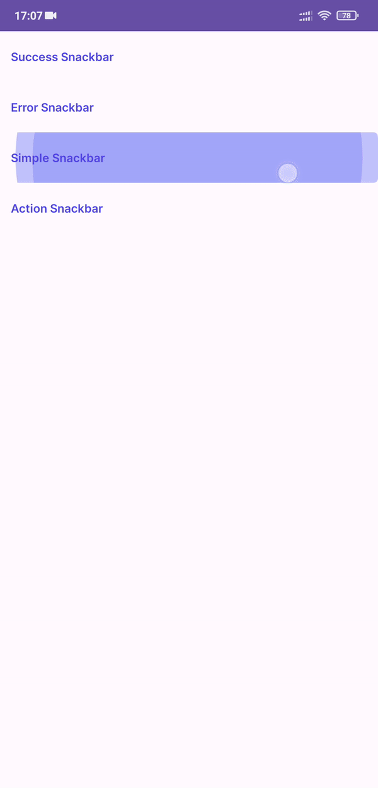

# Snackbars
**Contents**


*   [Snackbar Success](#snackbar-success)
*   [Snackbar Error](#snackbar-error)
*   [Snackbar Simple](#snackbar-simple)
*   [Snackbar Action](#snackbar-action)


## Snackbar Success
 

In the code:
```kt
// You can change the content of the success message and the duration of the snackbar appearance
showSuccessSnackbar(this, "Success", Snackbar.LENGTH_SHORT) 
```

## Snackbar Error
 

In the code:
```kt
// You can change the content of the error message and the duration of the snackbar appearance
// The default duration of the snackbar is Snackbar.LENGTH_SHORT
showErrorSnackbar(this, "Error")
```

## Snackbar Simple
 

In the code:
```kt
// You can change the content of the message, icon and the duration of the snackbar appearance
val icon = getDrawableBoxicon(this, "bx_alarm"
showSimpleSnackbar(this, "Alarm", icon)
```


## Snackbar Action
 

In the code:
```kt
// You can change the content of the message, text button and the duration of the snackbar appearance
showSnackbarAction(this, "Do some Action", "Action") {
    // action
    Toast.makeText(this, "Action from snackbar", Toast.LENGTH_SHORT).show()
}
```
