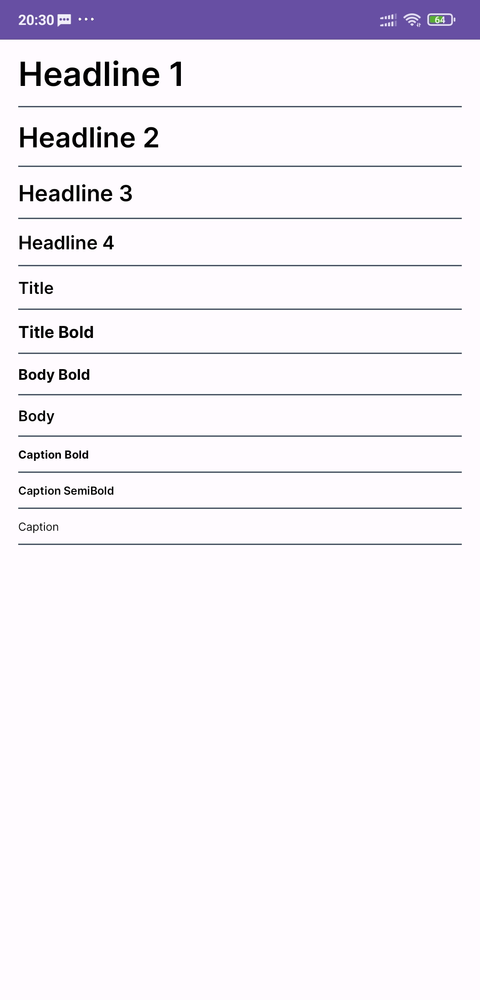

# Typography

 

In the layout:
```xml
<TextView
  android:layout_width="wrap_content"
  android:layout_height="wrap_content"
  android:text="Body"
  android:textAppearance="@style/body"
/>
```

| Style name              | Font Family            	| Text size
| ---------------         | ---------------------------  | -----------------------------------------
| headline1               | Inter SemiBold               | 36sp
| headline2               | Inter SemiBold               | 30sp
| headline3               | Inter SemiBold               | 24sp
| headline4               | Inter SemiBold               | 20sp
| title               | Inter SemiBold               | 18sp
| title_bold               | Inter Bold                   | 18sp
| body               | Inter SemiBold               | 16sp
| body_bold               | Inter Bold                   | 16sp
| subtitle               | Inter Regular                | 14sp
| subtitle_semi_bold               | Inter SemiBold               | 14sp
| subtitle_bold               | Inter Bold                   | 14sp
| caption               | Inter Regular                | 12sp
| caption_semi_bold               | Inter SemiBold               | 12sp
| caption_bold               | Inter Bold                   | 12sp

